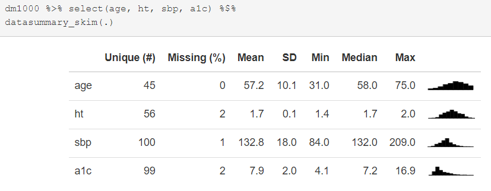
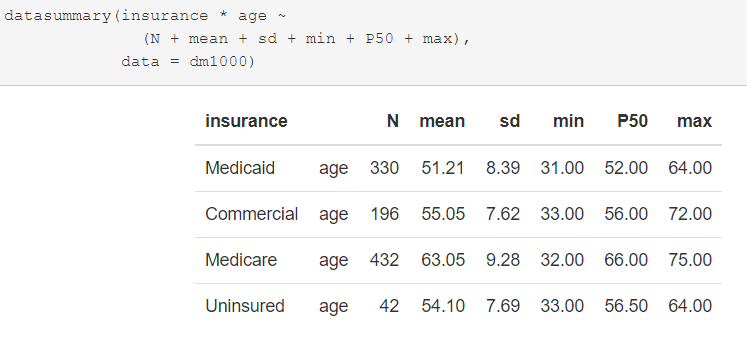
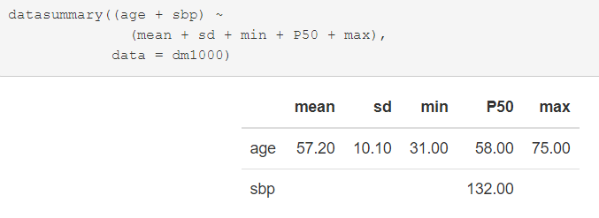
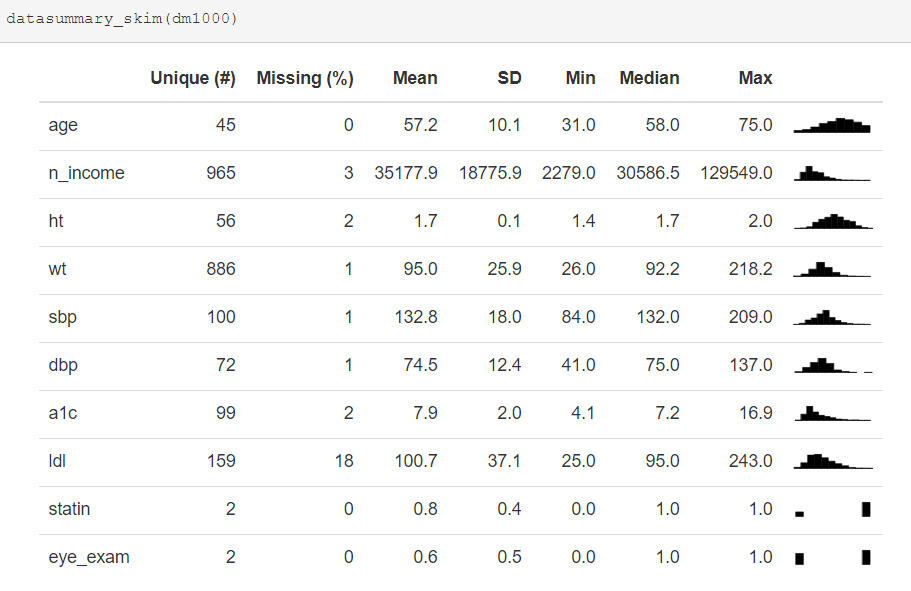

```{r setup, include=FALSE}
knitr::opts_chunk$set(comment=NA)
options(width = 55)
```

## Package Setup

```{r, message = FALSE}
library(janitor)
library(knitr)
library(magrittr)
library(modelsummary) # new today
library(naniar)
library(patchwork)
library(tidyverse)

theme_set(theme_bw())
```

## Loading Some New Data

```{r}
dm1000 <- read_csv("data/dm_1000.csv",
                   show_col_types = FALSE) %>%
  clean_names() %>%
  mutate(across(where(is.character), as_factor)) %>%
  mutate(subject = as.character(subject))
```

- 1000 (simulated) patients with diabetes between the ages of 31 and 75 who live in Cuyahoga County and are in one of four race-ethnicity categories, as well as one of four insurance categories.
- Same variables we saw in `dm431` last week, but 1000 new subjects, and one new variable (`residence`)

## Code Book

Variable | Description
-------: | :--------------------------------------------
`subject` | subject code (M-0001 through M-1000)
`age` | subject's age, in years
`insurance` | primary insurance, 4 levels
`n_income` | neighborhood median income, in $
`ht` | height, in meters (2 decimal places)
`wt` | weight, in kilograms (2 decimal places)
`sbp` | most recent systolic blood pressure (mm Hg)
`dbp` | most recent diastolic blood pressure (mm Hg)
`a1c` | most recent Hemoglobin A1c (%, with one decimal)
`ldl` | most recent LDL cholesterol level (mg/dl)

with seven more variables shown on the next slide...

## Remainder of `dm1000` codebook

Variable | Description
-------: | :--------------------------------------------
`tobacco` | most recent tobacco status, 3 levels
`statin` | 1 = prescribed a statin in past 12m, 0 = not
`eye_exam` | 1 = diabetic eye exam in past 12m, 0 = not
`race_ethnicity` | race/ethnicity category, 3 levels
`sex` | Female or Male
`county` | all subjects turn out to be in Cuyahoga County
`residence` | Cleveland or Suburbs

## Any Missing Data?

```{r, warning = FALSE, fig.height = 4}
gg_miss_var(dm1000)
```

- For now, `gg_miss_var()` throws a warning, which I've suppressed.

## How should we summarize data with missing values?

- If you are providing a data summary, then you should summarize the complete cases, and specify the number of missing values.
- If you are intending to use the sample you've collected to make an inference about a process or population or to build a model, then you may want to consider whether or not a complete-case analysis will introduce bias.


## What do graphs do with missing data?

```{r, fig.height = 4}
ggplot(data = dm1000, aes(x = ldl)) +
  geom_histogram(binwidth = 5, 
                 fill = "slateblue", col = "cyan")
```

## Exploring `ldl` in `dm1000` (warnings suppressed)

```{r, echo = FALSE, warning = FALSE, message = FALSE}
p1 <- ggplot(dm1000, aes(sample = ldl)) +
  geom_qq(col = "slateblue") + 
  geom_qq_line(col = "magenta") + 
  theme(aspect.ratio = 1) + 
  labs(title = "Normal Q-Q plot: dm1000 LDL")

p2 <- ggplot(dm1000, aes(x = ldl)) +
  geom_histogram(aes(y = stat(density)), 
                 bins = 20, fill = "slateblue", col = "cyan") +
  stat_function(fun = dnorm, 
                args = list(mean = mean(dm1000$ldl, na.rm = TRUE), 
                            sd = sd(dm1000$ldl, na.rm = TRUE)),
                col = "magenta", lwd = 1.5) +
  labs(title = "Density Function: dm1000 LDL")

p3 <- ggplot(dm1000, aes(x = ldl, y = "")) +
  geom_boxplot(fill = "slateblue", outlier.color = "slateblue") + 
  labs(title = "Boxplot: dm1000 LDL", y = "")

p1 + (p2 / p3 + plot_layout(heights = c(4,1)))

mosaic::favstats(~ ldl, data = dm1000) %>% kable(digits = 1)
```


## Numerical Summaries with missing values...

```{r}
summary(dm1000$a1c)
```

```{r}
mosaic::favstats(~ sbp, data = dm1000)
```

## Summarizing `dm1000` with tools from `modelsummary`

Note that `modelsummary` really works well for HTML output but not for these PDF slides, so I am using images from an HTML knitting of the code below to get the results you're seeing.

```{r, eval = FALSE}
dm1000 %>% select(age, ht, sbp, a1c) %$%
datasummary_skim(.)
```

- I've used `{r, eval = FALSE}` in the code chunk header to get R to print the code but not evaluate it in this slide.
- Results on next slide

---




## Summarizing age within insurance type

```{r}
mosaic::favstats(age ~ insurance, data = dm1000) %>%
  kable(digits = 0)
```

## datasummary: ages within insurance types

```{r, eval = FALSE}
datasummary(insurance * age ~ 
              (N + mean + sd + min + P50 + max), 
            data = dm1000, histogram = FALSE)
```

- Results on next slide

---




## Mean of `sbp`

```{r}
mean(dm1000$sbp)
```

```{r}
mean(dm1000$sbp, na.rm = TRUE)
```


## Summarizing `sbp` in `dm1000`

```{r}
mosaic::favstats(~ sbp, data = dm1000) %>%
  kable(digits = 1)
```

```{r}
Hmisc::describe(dm1000$sbp)
```

## Summarizing age and `sbp` with `datasummary`

```{r, eval = FALSE}
datasummary((age + sbp) ~ 
              (mean + sd + min + P50 + max), 
            data = dm1000)
```

- Results on next slide

---



## Applying `na.rm = TRUE` to multiple summaries

```{r, eval = FALSE}
datasummary((age + sbp + ldl + ht) ~ 
              (mean + sd + min + P50 + max) * 
              Arguments(na.rm = TRUE), 
            data = dm1000)
```

- Results on next slide

---


## `datasummary_skim` on the whole tibble

```{r, eval = FALSE}
datasummary_skim(dm1000)
```

- Again, results on next slide
- Which variables are NOT included?

---




## Using a Sample to Estimate a Population Mean

Suppose our sample in `dm1000` is a random sample from the population of all Cuyahoga County residents between the ages of 31-75 receiving care for diabetes.

What's a good estimate for the mean Hemoglobin A1c of the people in that population?

- How would we make this estimate using our data?
- What would we want to know about the data?
- DTDP

## Hemoglobin A1c in the `dm1000` sample

```{r, echo = FALSE, warning = FALSE, message = FALSE}
p1 <- ggplot(dm1000, aes(sample = a1c)) +
  geom_qq(col = "firebrick1") + 
  geom_qq_line(col = "black") + 
  theme(aspect.ratio = 1) + 
  labs(title = "Normal Q-Q plot: dm1000 a1c")

p2 <- ggplot(dm1000, aes(x = a1c)) +
  geom_histogram(aes(y = stat(density)), 
                 bins = 20, fill = "firebrick1", col = "khaki") +
  stat_function(fun = dnorm, 
                args = list(mean = mean(dm1000$a1c, na.rm = TRUE), 
                            sd = sd(dm1000$a1c, na.rm = TRUE)),
                col = "black", lwd = 1.5) +
  labs(title = "Density Function: dm1000 a1c")

p3 <- ggplot(dm1000, aes(x = a1c, y = "")) +
  geom_boxplot(fill = "firebrick1", outlier.color = "firebrick1") + 
  labs(title = "Boxplot: dm1000 a1c", y = "")

p1 + (p2 / p3 + plot_layout(heights = c(4,1)))

mosaic::favstats(~ a1c, data = dm1000) %>% kable(digits = 2)
```

## What if we assume the A1cs are Normally distributed?

Then we could use a linear regression model to obtain a 95% confidence interval for the population mean.

```{r}
m1 <- lm(a1c ~ 1, data = dm1000)
tidy(m1, conf.int = TRUE, conf.level = 0.95) %>% 
  select(estimate, conf.low, conf.high) %>%
  kable(digits = 3)
```

## What is the model we've fit here?

```{r}
m1
```

- This "intercept only" model simply predicts the mean value of our outcome, `a1c`.

## How do we interpret our 95% confidence interval?

We are estimating the mean of the **population** based on a mean from our *sample* of 1000 observations taken (at random, we assume) from that population.

- Our 95% confidence interval is (7.73, 7.98). 
  - Sadly, this **doesn't** mean we're 95% confident that the actual population mean is in that range, even though lots and lots of people (incorrectly) assume it does.
- Essentially, we have 95% confidence in the **process** of fitting confidence intervals this way. If we fit 100 such confidence intervals to a variety of data sets, we have some reason to anticipate that 95 of them will contain the actual unknown value of the population mean.
  - That's oversimplifying a little, and a particular concern in this case is that the data are somewhat skewed (at any rate, not very close to Normally distributed) and this may impact our ability to generate accurate and efficient confidence intervals via a linear model like this.

## An Equivalent Approach

We could use a t test to obtain a 95% confidence interval for the population mean.

```{r}
tt <- dm1000 %$% t.test(a1c, conf.level = 0.95)
tidy(tt) %>% select(estimate, conf.low, conf.high) %>%
  kable(digits = 3)
```

This is exactly the same result as we obtain from the linear model `m1`.

## Another Equivalent Approach

We could use a function called `smean.cl.normal()` from the `Hmisc` package to obtain the same 95% confidence interval for the population mean.

```{r}
dm1000 %$% Hmisc::smean.cl.normal(a1c, conf.int = 0.95) 
```

Again, this is the same result as we have seen previously.

## What if we weren't willing to assume that the A1c values came from a Normal distribution?

- My first instinct would be to use a bootstrap confidence interval to estimate the population mean with a 95% confidence interval.

```{r}
set.seed(20210914)  # why do we set a seed here?
dm1000 %$% Hmisc::smean.cl.boot(a1c, conf.int = 0.95) 
```

```{r}
set.seed(431)  # what happens if we change the seed
dm1000 %$% Hmisc::smean.cl.boot(a1c, conf.int = 0.95) 
```

## 95% Confidence Intervals for Population Mean A1c

Approach | Estimate | 95% CI | Assume Normality?
-------- | :--------: | :-------------: | :----------:
Linear Model (t test) | 7.85 | (7.73, 7.98) | Yes
Bootstrap | 7.85 | (7.73, 7.99)   | No

- How does this match up with our understanding of the distribution of the A1c data?
- Might the fairly large sample size (n = 984 non-missing) have something to do with these results?
- More on using regression models (and the bootstrap) to compare summaries is coming in Classes 13-15. 

# Comparing Two Distributions

## Is LDL higher or lower among adults with diabetes who have a statin prescription?

```{r, fig.height = 3.5}
ggplot(data = dm1000, aes(x = ldl)) +
  geom_histogram(bins = 15, fill = "green", col = "navy") +
  facet_wrap(~ statin)
```

## How might we improve this plot?

1. Remove the warning about non-finite (missing) values.
2. Place the histograms vertically to ease comparisons.
3. Fill the histograms differently for statin and no statin.
4. Augment the labels (0 and 1) to show they identify statin use.

## LDL stratified by `statin` status (First Try)

```{r, fig.height = 4}
dm1000 %>% filter(complete.cases(ldl, statin)) %>%
  ggplot(data = ., aes(x = ldl, fill = statin)) +
  geom_histogram(bins = 15, col = "white") +
  facet_grid(statin ~ ., labeller = "label_both")
```

## Problems with the previous plot

1. Statin is actually a two-category variable (1 and 0 are just codes) but the legend is treating it as if it was a numeric variable.
2. Do we actually need the legend (called a guide in R) or can we remove it?

## But `statin` is categorical? (Second Try)

```{r, fig.height = 4}
dm1000 %>% filter(complete.cases(ldl, statin)) %>%
  ggplot(data = ., aes(x = ldl, fill = factor(statin))) +
  geom_histogram(bins = 15, col = "white") +
  facet_grid(statin ~ ., labeller = "label_both") +
  guides(fill = "none")
```

## My Main Source for `ggplot2` Visualization Recipes

https://r-graphics.org/


## Comparison of densities (ignores relative frequency)

```{r, fig.height = 4}
dm1000 %>% filter(complete.cases(ldl, statin)) %>%
  ggplot(data = ., aes(x = ldl, fill = factor(statin))) +
  geom_density(alpha = 0.5) +
  scale_fill_viridis_d() +
  labs(fill = "Statin")
```

## Numerical Summaries comparing Two Groups

```{r}
dm1000 %>% filter(complete.cases(statin, ldl)) %>% 
  group_by(statin) %>%
  summarize(n = n(), min = min(ldl), med = median(ldl), 
            max = max(ldl), mean = mean(ldl), 
            sd = sd(ldl)) %>%
  kable(digits = 2)
```

- What is the difference in mean(LDL) between the two samples?

## Using `favstats` to compare LDL by Statin group

```{r}
dm1000 %$% 
  mosaic::favstats(ldl ~ statin)
```

We would have obtained the same result with:

```{r, eval = FALSE}
mosaic::favstats(ldl ~ statin, data = dm1000)
```

## Comparison Boxplot with Violins (LDL and statin)

Here's a first attempt...

```{r, fig.height = 3}
dm1000 %>% filter(complete.cases(ldl, statin)) %>%
  ggplot(data = ., aes(x = factor(statin), y = ldl)) +
  geom_violin() +
  geom_boxplot(aes(fill = factor(statin)), width = 0.3) + 
  labs(x = "Statin prescription (0 = no, 1 = yes)", 
       y = "LDL in mg/dl", fill = "Statin")
```

## Try 2: Boxplot with Violins for LDL and statin

```{r, fig.height = 3}
dm1000 %>% filter(complete.cases(ldl, statin)) %>%
  ggplot(data = ., aes(x = factor(statin), y = ldl)) +
  geom_violin(aes(fill = factor(statin))) +
  geom_boxplot(width = 0.3, outlier.size = 3) + 
  coord_flip() +
  guides(fill = "none") +
  labs(x = "Statin prescription (0 = no, 1 = yes)", 
       y = "LDL in mg/dl")
```

## Setting Up Third Try

```{r}
dm_for_boxplot <- dm1000 %>%
  filter(complete.cases(statin, ldl)) %>%
  mutate(statin_f = fct_recode(factor(statin),
                               "No Statin" = "0",
                               "Statin" = "1")) %>%
  select(subject, ldl, statin_f, statin)

head(dm_for_boxplot, 3) # print first three rows
```

## Third Try on Boxplot for LDL by Statin Use

```{r, fig.height = 3}
ggplot(data = dm_for_boxplot, aes(x = statin_f, y = ldl)) +
  geom_violin(aes(fill = statin_f)) +
  geom_boxplot(width = 0.3, outlier.size = 3) + 
  coord_flip() + guides(fill = "none") +
  scale_fill_viridis_d(alpha = 0.6) +
  labs(x = "Statin prescription", 
       y = "LDL in mg/dl")
```

## 95% confidence interval for difference between population mean LDL WITH statin and population mean LDL WITHOUT statin

**If** we are willing to assume that LDL follows a Normal distribution in each statin group, then we can use the following linear model with one predictor.

```{r}
m2 <- lm(ldl ~ statin, data = dm1000)
tidy(m2, conf.int = TRUE, conf.level = 0.95) %>% 
  select(term, estimate, conf.low, conf.high) %>%
  kable(digits = 3)
```

## Alternative Approach to get same result

```{r}
tt <- t.test(ldl ~ statin, data = dm1000, 
       var.equal = TRUE, conf.level = 0.95)
tidy(tt) %>% select(estimate, conf.low, conf.high) %>%
  kable(digits = 3)
```


## 95% confidence interval for difference between population mean LDL WITH statin and population mean LDL WITHOUT statin

If we are not willing to assume a Normal distribution for LDL in either the statin or the "no statin" group, then we could use a bootstrap approach.

```{r}
source("data/Love-boost.R")
set.seed(20210914)
dm1000 %$% bootdif(y = ldl, 
                   g = factor(statin), 
                   conf.level = 0.95)
```

## 95% confidence intervals for $\mu_{No Statin} - \mu_{Statin}$

Approach | Estimate | 95% CI | Normality Assumption?
--------: | -------: | -----: | --------
linear model | 7.04 | (0.86, 13.21) | Yes
bootstrap | 7.04 | (1.29, 12.89) | No

Assumptions these intervals share:

- random samples from the populations of interest
- independent samples (samples aren't paired or matched)

Additional assumptions for linear model:

- Normal distribution in each group (statin and "no statin")
- variance in each group (statin and "no statin") is equal

## Next Time

- Visualizing Comparisons across 3+ batches
- Correlation and Scatterplots

