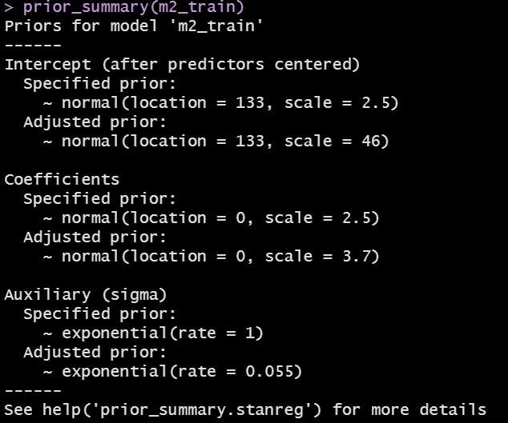
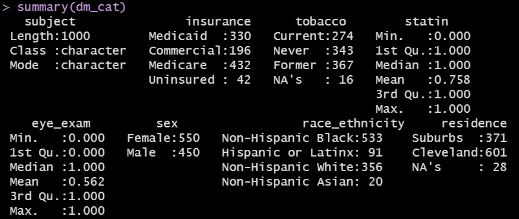
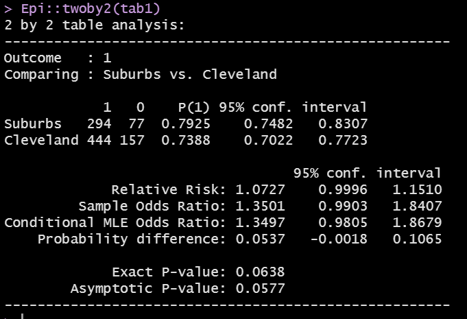

```{r setup, include=FALSE}
knitr::opts_chunk$set(comment=NA)
options(width = 55)
```

## Today's Agenda

1. Developing Four Models for `sbp` using `dbp` (and `insurance`)
2. Fitting a Bayesian Linear Model with default priors (`m2`)
3. Including Insurance without (`m3`) and with (`m4`) interaction with `dbp` in linear models
4. Visualizing Categorical Data
5. Assessing Association in Cross-Tabulations

## Today's Packages

```{r, message = FALSE}
library(broom)
library(equatiomatic) # new today
library(ggrepel) # sort of new today
library(glue) # sort of new today
library(janitor)
library(knitr)
library(magrittr)
library(patchwork)
library(rstanarm) # special today
library(tidyverse)

theme_set(theme_bw())
```

## Today's Data

Again, we'll use an R data set (`.Rds`) to import the `dm1000` data.

```{r}
dm1000 <- read_rds("data/dm_1000.Rds")
```

Then, we'll again partition the `dm1000` cases with complete BP data into training and test samples.

```{r}
dm994 <- dm1000 %>% filter(complete.cases(sbp, dbp)) %>%
  select(subject, sbp, dbp, insurance)

set.seed(4312021) # for replicating the sampling later
dm_train <- dm994 %>% sample_frac(0.7)
dm_test <- dm994 %>% anti_join(dm_train, by = "subject")
```


# Back to Regression: Can `dbp` predict `sbp`?

## Plotting `sbp` vs. `dbp` (training set)

```{r, echo = FALSE}
ggplot(data = dm_train, aes(x = dbp, y = sbp)) +
  geom_point() + 
  geom_smooth(method = "loess", col = "blue",
              se = FALSE, formula = y ~ x) +
  geom_smooth(method = "lm", col = "red",
              se = FALSE, formula = y ~ x) +
  geom_label(x = 120, y = 100, size = 5,
            label = glue('Pearson r = {round_half_up(
            cor(dm_train$sbp, dm_train$dbp),2)}.')) +
  labs(title = "Positive Association of SBP and DBP",
       subtitle = "loess smooth in blue, OLS model in red",
       caption = 
         glue('{nrow(dm_train)} subjects from dm_train.'))
```

## Model `m1` for `sbp` using `dbp` (training set)

```{r}
m1_train <- lm(sbp ~ dbp, data = dm_train)

tidy(m1_train, conf.int = TRUE, conf.level = 0.90) %>% 
  select(term, estimate, conf.low, conf.high) %>% kable()

glance(m1_train) %>% select(nobs, r.squared, adj.r.squared, 
                            sigma, AIC, BIC) %>% kable()
```

## m1_train: Residuals vs. Predicted (Fitted) Values

```{r}
m1_train_aug <- augment(m1_train, data = dm_train)
```

```{r, echo = FALSE, fig.height = 5}
ggplot(m1_train_aug, aes(x = .fitted, y = .resid)) +
  geom_point() +
  geom_smooth(method = "lm", col = "red",
              formula = y ~ x, se = FALSE) + 
  geom_smooth(method = "loess", col = "blue",
              formula = y ~ x, se = FALSE) +
  labs(title = "m1_train: Residuals vs. Fitted Values", 
       x = "Fitted sbp values", y = "Residuals")
```

## Use model `m1_train` to predict SBP in `dm_test`

```{r, message = FALSE}
m1_test_aug <- augment(m1_train, newdata = dm_test)

mosaic::favstats(~ abs(.resid), data = m1_test_aug) %>%
  select(n, min, median, max, mean, sd) %>% kable(digits = 3)

sqrt(mean(m1_test_aug$.resid^2))
```

Summary | Model `m1`
---------: | -------:
Mean Absolute Prediction Error | `r round_half_up(mean(abs(m1_test_aug$.resid)),3)`
Maximum Absolute Prediction Error | `r round_half_up(max(abs(m1_test_aug$.resid)),3)`
Root Mean Squared Prediction Error (RMSPE) | `r round_half_up(sqrt(mean(m1_test_aug$.resid^2)),3)`

## Is this the only linear model R can fit to these data?

Nope.

```{r, message = FALSE}
library(rstanarm)

m2_train <- stan_glm(sbp ~ dbp, data = dm_train)
```

## Default Prior Details

```{r, eval = FALSE}
prior_summary(m2_train)
```

```{r, echo = FALSE, out.height = "70%", fig.align = "center"}

```

## Bayesian fitted linear model for our sbp data

```{r}
print(m2_train)
```

## Is the Bayesian model (with default prior) very different from our `lm` in this situation?

```{r}
broom::tidy(m1_train) # fit with lm

broom.mixed::tidy(m2_train) # stan_glm with default priors
```

## Obtaining fits and residuals from Model `m2`

### In the model training sample

```{r}
m2_train_aug <- dm_train %>% select(subject, sbp, dbp) %>%
  mutate(.fitted = predict(m2_train, newdata = dm_train),
         .resid = sbp - .fitted)
```

### In the model test sample

```{r}
m2_test_aug <- dm_test %>% select(subject, sbp, dbp) %>%
  mutate(.fitted = predict(m2_train, newdata = dm_test),
         .resid = sbp - .fitted)
```


## Residuals vs. Fitted Values from Model `m2` (training)

```{r, echo = FALSE}
ggplot(m2_train_aug, aes(x = .fitted, y = .resid)) +
  geom_point() +
  geom_smooth(method = "lm", col = "red",
              formula = y ~ x, se = FALSE) + 
  geom_smooth(method = "loess", col = "blue",
              formula = y ~ x, se = FALSE) +
  labs(title = "m2_train: Residuals vs. Fitted Values", 
       x = "Fitted sbp values", y = "Residuals")
```

## Out-of-Sample (Test Set) Error Summaries (`m2`)

```{r}
mosaic::favstats(~ abs(.resid), data = m2_test_aug) %>%
  select(n, min, median, max, mean, sd) %>% kable(digits = 3)

sqrt(mean(m2_test_aug$.resid^2))
```

Test Set Error Summary | OLS model `m1` | Bayes model `m2`
----: | ----: | -----:
Mean Absolute Prediction Error | `r round_half_up(mean(abs(m1_test_aug$.resid)),3)` | `r round_half_up(mean(abs(m2_test_aug$.resid)),3)`
Maximum Absolute Prediction Error | `r round_half_up(max(abs(m1_test_aug$.resid)),3)` | `r round_half_up(max(abs(m2_test_aug$.resid)),3)`
Root Mean Squared Prediction Error | `r round_half_up(sqrt(mean(m1_test_aug$.resid^2)),3)` | `r round_half_up(sqrt(mean(m2_test_aug$.resid^2)),3)`

# What if we add another predictor? (Insurance)

## Plotting `sbp` vs. `dbp` and `insurance`

```{r, fig.height = 4.5}
ggplot(data = dm_train, aes(x = dbp, y = sbp, 
                col = insurance, group = insurance)) +
  geom_point() + 
  geom_smooth(method = "lm", formula = y ~ x, se = FALSE)
```

## Two possible models

```{r}
m3_train <- lm(sbp ~ dbp + insurance, data = dm_train)
m4_train <- lm(sbp ~ dbp * insurance, data = dm_train)
```

- What is the difference between `m3` and `m4`?
  - Model `m3` will allow the intercept term of the `sbp`-`dbp` relationship to vary depending on insurance.
  - Model `m4` will allow both the slope and intercept of the `sbp`-`dbp` relationship to vary depending on insurance.

## Equation for `m3` (`sbp` ~ `dbp` + `insurance`)

```{r, results = 'asis'}
extract_eq(m3_train, use_coefs = TRUE, 
           wrap = TRUE, terms_per_line = 2)
```

>- Predicted `sbp` by `m3` for a Commercial subject?
>- `sbp` = 77.58 + 0.72*`dbp` + 1.11(1) + 2.73(0) + 1.16(0)
>- `sbp` = 78.69 + 0.72*`dbp`
>- For a Medicaid subject, `m3` predicts `sbp` = 77.58 + 0.72 `dbp`
>- For a Medicare subject, `m3` predicts `sbp` = 80.31 + 0.72 `dbp`
>- For an uninsured subject, `m3` predicts `sbp` = 78.74 + 0.72 `dbp`
>- Note: only the intercept term varies by insurance in `m3`.

## Equation for `m4` (`sbp` ~ `dbp` * `insurance`)

```{r, results = 'asis'}
extract_eq(m4_train, use_coefs = TRUE, 
           wrap = TRUE, terms_per_line = 2)
```

>- `m4` predicts, for a Commercial subject...
>- `sbp` = 60.26 + 0.94 * `dbp` + 23.54 (1) + 31.04 (0) + 25.78 (0) - 0.29 (dbp * 1) - 0.38 (dbp * 0) - 0.32 (dbp * 0)
>- `sbp` = (60.26 + 23.54) + (0.94 - 0.29) * `dbp`
>- `sbp` = 83.80 - 0.65 `dbp` for Commercial subjects

## Equation for `m4` (`sbp` ~ `dbp` * `insurance`)

```{r, results = 'asis'}
extract_eq(m4_train, use_coefs = TRUE, 
           wrap = TRUE, terms_per_line = 2)
```

- For Medicaid subjects, `sbp` = 60.26 + 0.94 * `dbp`
- For Medicare subjects, `sbp` = 91.30 + 0.56 * `dbp`
- For the uninsured, `sbp` = 86.04 + 0.62 * `dbp`
- So both the slope and the intercept are changing in `m4`

## Training Sample Fit Quality

### Model `m3` (no interaction)

```{r}
glance(m3_train) %>% 
  select(r.squared, adj.r.squared, sigma, AIC, BIC) %>% 
  kable(digits = c(3, 3, 1, 1, 1))
```

### Model `m4` (with `dbp`-`insurance` interaction)

```{r, echo = FALSE}
glance(m4_train) %>% 
  select(r.squared, adj.r.squared, sigma, AIC, BIC) %>% 
  kable(digits = c(3, 3, 1, 1, 1))
```


## Augmenting and Testing Models `m3` and `m4`

```{r}
m3_train_aug <- augment(m3_train, data = dm_train)
m3_test_aug <- augment(m3_train, newdata = dm_test)

m4_train_aug <- augment(m4_train, data = dm_train)
m4_test_aug <- augment(m4_train, newdata = dm_test)
```

## Residuals vs. Fitted Values Plots

```{r, echo = FALSE}
p1 <- ggplot(m3_train_aug, aes(x = .fitted, y = .resid)) +
  geom_point() +
  geom_smooth(method = "lm", col = "red",
              formula = y ~ x, se = FALSE) + 
  geom_smooth(method = "loess", col = "blue",
              formula = y ~ x, se = FALSE) +
  labs(title = "Model m3_train", 
       x = "Fitted sbp values", y = "Residuals")

p2 <- ggplot(m4_train_aug, aes(x = .fitted, y = .resid)) +
  geom_point() +
  geom_smooth(method = "lm", col = "red",
              formula = y ~ x, se = FALSE) + 
  geom_smooth(method = "loess", col = "blue",
              formula = y ~ x, se = FALSE) +
  labs(title = "Model m4_train", 
       x = "Fitted sbp values", y = "Residuals")

p1 + p2
```


## Comparing performance on the training data

```{r}
bind_rows(glance(m1_train), glance(m2_train),
          glance(m3_train), glance(m4_train)) %>%
  mutate(modname = c("m1", "m2", "m3", "m4")) %>%
  select(modname, r2 = r.squared, adj_r2 = adj.r.squared, 
         sigma, AIC, BIC) %>%
  kable(digits = c(0, 3, 3, 2, 1, 1))
```


- The `glance()` function produces different results for a Bayesian `stan_glm()` model like `m2`, so we'll ignore that for now.

## Comparing performance on the test data

Here are some fundamental summaries of absolute prediction error (APE) along with the root mean squared prediction error (RMSPE) for each of our models, in the **testing** sample.

Summary | Mean APE | Max APE | RMSPE
--------: | --------: | -------: | -------:
`m1_train`: `lm` | `r round_half_up(mean(abs(m1_test_aug$.resid)),2)` | `r round_half_up(max(abs(m1_test_aug$.resid)),2)` | `r round_half_up(sqrt(mean(m1_test_aug$.resid^2)),2)`
`m2_train`: `stan_glm` | `r round_half_up(mean(abs(m2_test_aug$.resid)),2)` | `r round_half_up(max(abs(m2_test_aug$.resid)),2)` | `r round_half_up(sqrt(mean(m2_test_aug$.resid^2)),2)`
`m3_train`: `dbp+insurance` | `r round_half_up(mean(abs(m3_test_aug$.resid)),2)` | `r round_half_up(max(abs(m3_test_aug$.resid)),2)` | `r round_half_up(sqrt(mean(m3_test_aug$.resid^2)),2)`
`m4_train`: `dbp*insurance` | `r round_half_up(mean(abs(m4_test_aug$.resid)),2)` | `r round_half_up(max(abs(m4_test_aug$.resid)),2)` | `r round_half_up(sqrt(mean(m4_test_aug$.resid^2)),2)`

- Which of these models displays the strongest predictive performance in our test sample?

# Visualizing Categorical Data in `dm1000`

## 8 Categorical Variables from `dm1000`

```{r, message = FALSE}
dm_cat <- dm1000 %>%
  select(subject, sex, residence, insurance, 
         tobacco, race_ethnicity, statin, eye_exam)
```

### Codebook

- `subject` = ID value (treat as character)
- **sex** = Female or Male (no missing data)
- **insurance** = Medicare, Commercial, Medicaid, Uninsured
- **eye_exam** = 1 for eye examination in past year, else 0
- **statin** = 1 statin prescription in past year, else 0
- **race_ethnicity** = 4 levels (Hispanic or Latinx, Non-Hispanic White, Non-Hispanic Black, Non-Hispanic Asian)
- **residence** = 2 levels (Suburbs, Cleveland), some NA
- **tobacco** = 3 levels (Current, Former, Never), some NA

## Using `summary()`

```{r, eval = FALSE}
summary(dm_cat)
```


```{r, echo = FALSE, out.width = "90%", fig.align = "center"}

```

## Using `tabyl` to tabulate a categorical variable

```{r}
dm_cat %>% tabyl(tobacco) %>% 
  adorn_pct_formatting() %>%
  adorn_totals()
```

## Using `count` to create a tibble of counts

```{r}
dm_cat %>% count(tobacco)
```

## Using `geom_bar` to show a distribution

```{r, fig.height = 5}
ggplot(dm_cat, aes(x = tobacco)) +
  geom_bar()
```

## Augmenting the `geom_bar` result (code)

```{r, eval = FALSE}
dm_cat %>% filter(complete.cases(tobacco)) %>%
  ggplot(data = ., aes(x = tobacco, fill = tobacco)) +
  geom_bar() + 
  geom_text(aes(label = ..count..), stat = "count", 
            vjust = 1.5, col = "white") +
  guides(fill = "none")
```

## Augmenting the `geom_bar` result 

```{r, echo = FALSE}
dm_cat %>% filter(complete.cases(tobacco)) %>%
  ggplot(data = ., aes(x = tobacco, fill = tobacco)) +
  geom_bar() + 
  geom_text(aes(label = ..count..), stat = "count", 
            vjust = 1.5, col = "white") +
  guides(fill = "none")
```

## Using `tabyl` to cross-tabulate two variables

```{r}
dm_cat %>% tabyl(insurance, residence) %>% 
  adorn_totals(where = c("row", "col"))
```

## Using `count` to create a tibble of counts

```{r}
dm_cat %>% count(statin, residence)
```

## Were suburban residents more likely to have a statin prescription?

```{r}
dm_cat %>% 
  filter(complete.cases(statin, residence)) %>%
  tabyl(residence, statin)
```

## Revise the order of the statin levels, add percentages

```{r}
dm_cat %>% filter(complete.cases(statin, residence)) %>%
  mutate(statin = fct_relevel(factor(statin), "1", "0")) %>%
  tabyl(residence, statin)
```

```{r}
dm_cat %>% filter(complete.cases(statin, residence)) %>%
  mutate(statin = fct_relevel(factor(statin), "1", "0")) %>%
  tabyl(residence, statin) %>% 
  adorn_percentages(denom = "row") %>%
  adorn_pct_formatting()
```

## Create using `table` instead

```{r}
tab1 <- dm_cat %>% 
  filter(complete.cases(statin, residence)) %>%
  mutate(statin = fct_relevel(factor(statin), "1", "0")) %$%
  table(residence, statin)
```

### Assess 2x2 table (results on next slide)

```{r, eval = FALSE}
Epi::twoby2(tab1)
```

## `twoby2` results

```{r, echo = FALSE, out.height = "80%", fig.align = "center"}

```

## A three-by-four two-way table

```{r}
dm_cat %>% filter(complete.cases(tobacco, insurance)) %>%
  tabyl(tobacco, insurance) %>%
  adorn_totals(where = c("row", "col"))
```

- 3 rows, 4 columns: hence, this is a 3 x 4 table
- It's a two-way table, because we are studying the association of two variables (`tobacco` and `insurance`)
- Can we compare the insurance percentages by tobacco group?

## Compare insurance rates by tobacco group

```{r}
dm_cat %>% filter(complete.cases(tobacco, insurance)) %>%
  tabyl(tobacco, insurance) %>% 
  adorn_percentages(denominator = "row") %>%
  adorn_totals(where = "col") %>% kable(digits = 3)
```

- Note that these are actually **proportions** and not percentages.
- Proportions fall between 0 and 1: multiply by 100 for percentages.

## Insurance rates by tobacco group?

```{r}
tab2 <- dm_cat %>% 
  filter(complete.cases(tobacco, insurance)) %$%
  table(tobacco, insurance)

tab2

chisq.test(tab2)
```

## Using `count` for three variables

```{r}
dm_cat %>% count(sex, statin, eye_exam)
```


## A three-way table

```{r}
dm_cat %>% tabyl(statin, residence, sex) %>% 
  adorn_title() 
```

## Flattening a three-way table

```{r}
dm_cat %$% 
  ftable(sex, residence, statin)
```

- Note that `ftable()` excludes the missing `residence` values by default.

## Reminder of Today's Agenda

1. Developing Four Models for `sbp` using `dbp` (and `insurance`)
2. Fitting a Bayesian Linear Model with default priors (`m2`)
3. Including Insurance without (`m3`) and with (`m4`) interaction with `dbp` in linear models
4. Visualizing Categorical Data
5. Assessing Association in Cross-Tabulations
