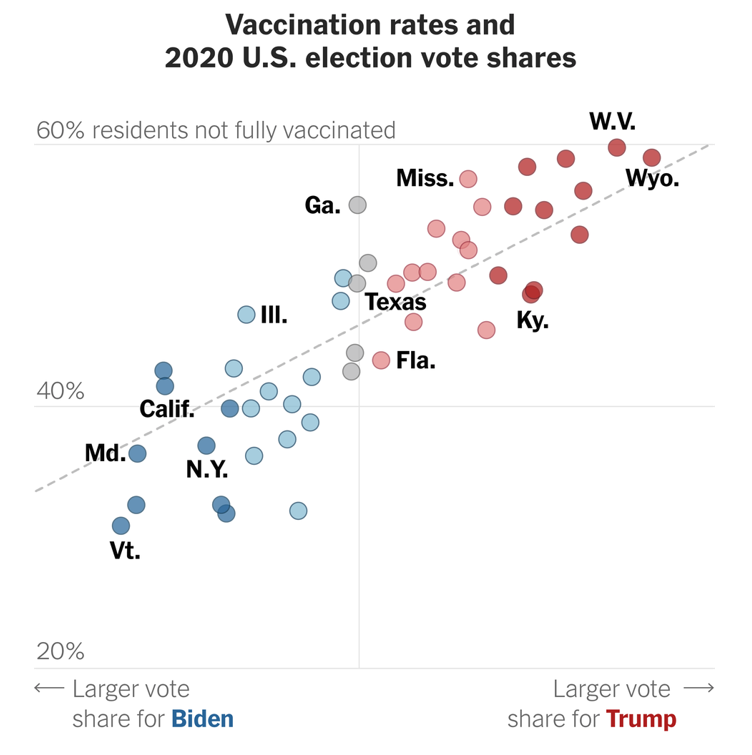
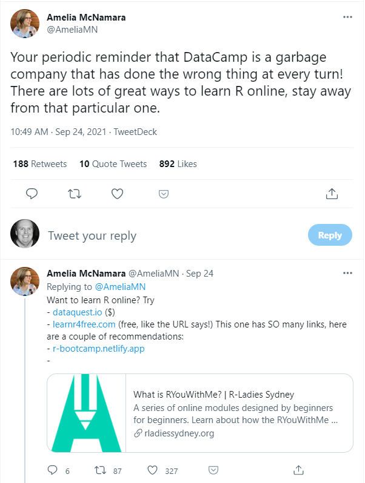

# 431 Class 11: 2021-09-28

[Main Website](https://thomaselove.github.io/431/) | [Course Calendar](https://thomaselove.github.io/431/calendar.html) | [Syllabus](https://thomaselove.github.io/431-2021-syllabus/) | [Course Notes](https://thomaselove.github.io/431-notes/) | [Piazza & TA Office Hours](https://thomaselove.github.io/431/contact.html) | [Canvas](https://canvas.case.edu) | [Data and Code](https://github.com/THOMASELOVE/431-data)
:-----------: | :--------------: | :----------: | :---------: | :-------------: | :-----------: | :------------:
for everything | for deadlines | expectations | from Dr. Love | ways to get help | labs & recordings | for downloads

Here's a graph from *The New York Times* showing the political divide over COVID-19 vaccinations. The relevant piece is called [Red Covid](https://www.nytimes.com/2021/09/27/briefing/covid-red-states-vaccinations.html) by David Leonhardt, posted 2021-09-27, and includes a couple of additional interesting visualizations. 

David's [twitter thread](https://twitter.com/DLeonhardt/status/1442454472144293898) makes the following points...

- "The political divide over vaccinations is so large that almost every reliably blue state now has a higher vaccination rate than almost every reliably red state."
- "It's worth remembering that Covid followed a different pattern for more than a year after its arrival in the U.S. It was somewhat worse in blue areas (which are home to most of the country's international travel hubs) than red areas."
- "In counties where Donald Trump received at least 70 percent of the vote, the virus has killed about 47 out of every 100,000 people since the end of June, per @charles_gaba. In counties where Trump won less than 32 percent of the vote, the number is about 10 out of 100,000."

## Today's Slides

- Dr. Love's slides are available in [PDF format](https://github.com/THOMASELOVE/431-2021/blob/main/classes/class11/431-class11-slides.pdf), as well as in [R Markdown](https://github.com/THOMASELOVE/431-2021/blob/main/classes/class11/431-class11-slides.Rmd).
- The recording will be made available approximately 24 hours after class through our Shared Google Drive and via Modules and Echo 360 on [Canvas](https://canvas.case.edu).

## Announcements

1. We'll post the Answer Sketch for Lab 3 by class time.
2. Grades on Lab 2 will be available on the Course Grading Roster by class time.
3. You will receive Quiz 1 no later than 9 AM on Friday 2021-10-01. I will be away from Friday 2021-10-01 through Sunday 2021-10-03, but will respond to any Quiz 1-related (and other) questions as soon as possible on my return. Remember that Quiz 1 is due Monday 2021-10-04 at 9 PM.
4. I have modified [Section 12 of the Syllabus](https://thomaselove.github.io/431-2021-syllabus/general-course-policies.html) slightly to modify the attendance policy. I now expect you to email me if you will miss **more than** two classes in a row. I also encourage you to review the [In Case of Emergency policies in Section 3](https://thomaselove.github.io/431-2021-syllabus/in-case-of-emergency.html). If you have any questions, please let me know.
5. Apparently, there is a class (not 431 but a class which some 431 students are taking) which is going remote for 10 days. Certainly, if you have been identified as a close contact of someone who has tested positive for COVID-19, you are not supposed to attend any class, including 431, until you have met the University's requirements for returning to in-person instruction. At present, I have no plans for our class to be given in any way other than the usual in-person at 1 PM Tuesdays and Thursdays, with a recording made available the next day. If things change, I'll let you know.
6. The Population Health Research Institute at MetroHealth is holding a major Zoom seminar on Friday 2021-10-01 from 9:00 to 10:30 AM. It is entitled **Population Health: Major Opportunities for an Evolving Field**, and it will be given by Marc N. Gourevitch, MD, MPH, who is the Muriel and George Singer Professor of Population Health and Chair of the Department of Population Health at NYU Grossman School of Medicine. 
    - Dr. Gourevitch leads the [City Health Dashboard project](https://www.cityhealthdashboard.com/). 
    - The [Zoom link and further details can be found here](https://www.metrohealth.org/population-health-research-institute/seminar-series) should you wish to attend all or part of the session.

## Upcoming Deliverables

1. [Minute Paper after Class 11](https://bit.ly/431-2021-minute-11) is due Wednesday 2021-09-29 at noon.
2. Early Review deadline for the [Project A](https://thomaselove.github.io/431-2021-projectA/) Proposal is noon on Friday 2021-10-01.
    - The actual Proposal is due 2021-10-11, but if you submit by the deadline above, we'll review it and return it by 2021-10-06 so you can maximize your chances of getting through it in just one pass.
3. [Quiz 1](https://github.com/THOMASELOVE/431-2021/tree/main/quizzes) will be yours by Friday 2021-10-01, and is due at 9 PM Monday 2021-10-04.

## Favorite Movies

We'll return to the favorite movies data for a small activity later in today's class.

Thanks to the 40 of you who voted in my little poll on Piazza at the end of last week. I asked which of the ten movies I listed would be the one seen by more of you than the others. Nine of the ten films (the exception was *Memento*) received votes, as listed below. We'll see who was right in the [Minute Paper after Class 11](https://bit.ly/431-2021-minute-11), which is due Wednesday 2021-09-29 at Noon.

- *The Matrix*, 17 votes
- *Lord of the Rings: The Fellowship of the Ring*, 8 votes
- *The Shawshank Redemption*, *The Princess Bride* and *Pulp Fiction* each had 4
- 1 vote each for *Spirited Away*, *The Silence of the Lambs*, *Soul*, and *Moonlight*

## One Last Thing

 [Link](https://twitter.com/AmeliaMN/status/1441414448846094339)

- More details as to why I cannot support the use of Datacamp can be found in [this article](https://www.buzzfeednews.com/article/daveyalba/datacamp-sexual-harassment-metoo-tech-startup) and [this one, too](https://dnlmc.medium.com/dont-use-datacamp-ef04adcf1b7f).
