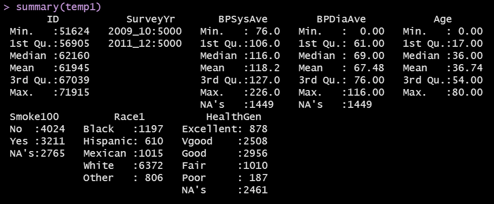
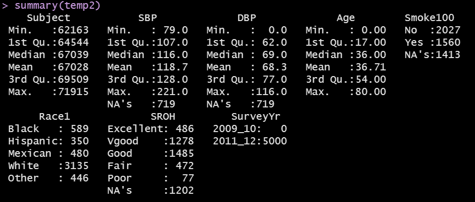
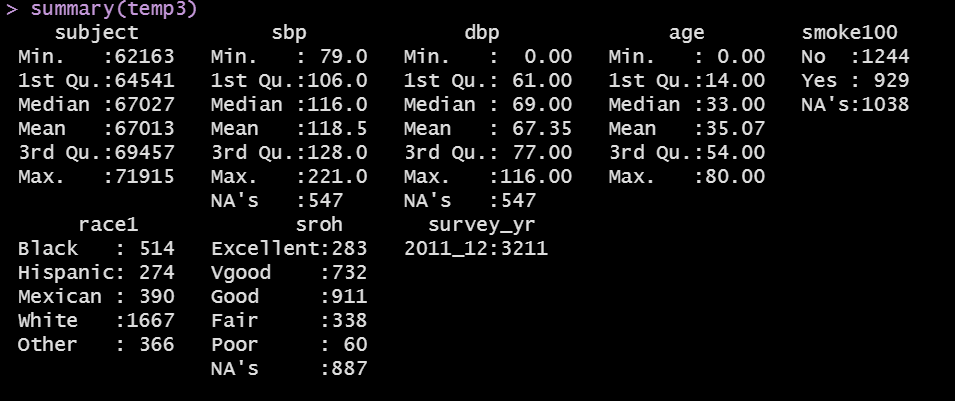
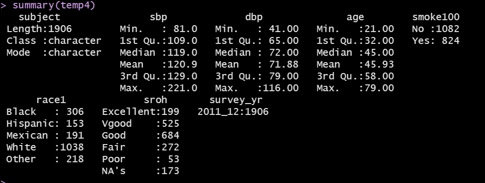
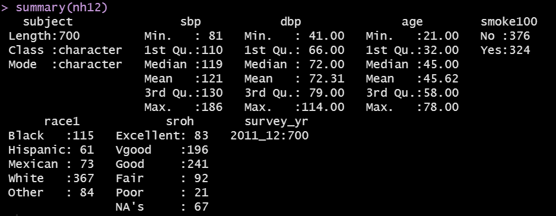

```{r setup, include=FALSE}
knitr::opts_chunk$set(comment=NA)
options(width = 55)
```

## Today's Agenda

1. Using data from NHANES
2. A complex data management challenge
3. Using `dbp` to predict `sbp` again
4. Considering a transformation of our outcome

## Today's Packages

```{r, message = FALSE}
library(NHANES) # for access to NHANES data
library(ggpubr) # to add equation to scatterplot easily
library(equatiomatic)
library(glue)
library(janitor)
library(knitr)
library(broom)
library(magrittr)
library(patchwork)
library(tidyverse)

theme_set(theme_bw())
```

# Ingesting and Managing Today's Data

## Today's Data

The `NHANES` data file located in the `NHANES` package is our source.

> NHANES stands for National Health and Nutrition Examination surveys. The NHANES target population is "the non-institutionalized civilian resident population of the United States". Since 1999, approximately 5,000 individuals of all ages are interviewed in their homes every year and complete the health examination component, in a mobile examination centre.

> `NHANES` and `NHANESraw` each include 75 variables for the 2009-2010 and 2011-2012 sample years, with complex sampling weights included in `NHANESraw`. `NHANES` contains 10,000 rows of data resampled from `NHANESraw` to undo oversampling effects. `NHANES` can be treated, for educational purposes, as if it were a simple random sample from the American population.

- For today, we'll do the one thing you should never do with NHANES data, which is to ignore the sampling weights.

## Today's Data Ingest and Management

- We'll walk through these steps in the next few slides.

```{r}
set.seed(20210930) 
nh12 <- NHANES %>%
    filter(SurveyYr == "2011_12") %>%
    select(ID, BPSysAve, BPDiaAve, Age, Smoke100, 
           Race1, HealthGen, SurveyYr) %>%
    rename(Subject = ID, SBP = BPSysAve, DBP = BPDiaAve,
           SROH = HealthGen) %>%
    clean_names() %>%
    mutate(across(where(is.character), as_factor)) %>%
    mutate(subject = as.character(subject)) %>%
    filter(age > 20 & age < 80) %>%
    filter(dbp > 39) %>%
    distinct() %>%
    slice_sample(n = 700) %>%
    droplevels()
```

## Today's Data Management: Step 1

- Select the eight variables of interest from NHANES.

```{r}
temp1 <- NHANES %>%
    select(ID, SurveyYr, BPSysAve, BPDiaAve, Age, Smoke100, 
           Race1, HealthGen) 
 #   filter(SurveyYr == "2011_12") %>%
 #   rename(Subject = ID, SBP = BPSysAve, DBP = BPDiaAve,
 #          SROH = HealthGen) %>%
 #    clean_names() %>%
 #    mutate(across(where(is.character), as_factor)) %>%
 #    mutate(subject = as.character(subject)) %>%
 #    filter(age > 20 & age < 80) %>%
 #    filter(dbp > 39) %>%
 #    distinct() %>%
 #    slice_sample(n = 700) %>%
 #    droplevels()
```

## `temp1` is a tibble.

```{r}
temp1
```

## Summarizing `temp1`

```{r, echo = FALSE, out.width = "95%", fig.align = "center"}

```

## Today's Data: Step 2

- Restrict to 2011-12 data, and rename some variables.

```{r}
temp2 <- NHANES %>%
    filter(SurveyYr == "2011_12") %>%
    select(ID, BPSysAve, BPDiaAve, Age, 
           Smoke100, Race1, HealthGen, SurveyYr) %>%
    rename(Subject = ID, SBP = BPSysAve, 
           DBP = BPDiaAve, SROH = HealthGen)
```

## The `temp2` tibble

```{r}
temp2
```

## Summary of `temp2`

```{r, echo = FALSE, out.width = "95%", fig.align = "center"}

```

## Today's Data: Step 3

- Drop unused level (2009-10) from SurveyYr summary with `droplevels()`.
- Clean up the names to lower case with underscores using `clean_names()`.
- Use only distinct observations with `distinct()`.

```{r}
temp3 <- NHANES %>%
    filter(SurveyYr == "2011_12") %>%
    select(ID, BPSysAve, BPDiaAve, Age, 
           Smoke100, Race1, HealthGen, SurveyYr) %>%
    rename(Subject = ID, SBP = BPSysAve, 
           DBP = BPDiaAve, SROH = HealthGen) %>%
    clean_names() %>%
    distinct() %>%
    droplevels()
```

## The `temp3` tibble

```{r}
temp3
```

## Summary of `temp3`

```{r, echo = FALSE, out.width = "95%", fig.align = "center"}

```

## Today's Data: Step 4

- Make Race1 and HealthGen into factors, leave ID as character.
- Restrict Age to 21-79, and require DBP >= 40 mm Hg.

```{r}
temp4 <- NHANES %>%
    filter(SurveyYr == "2011_12") %>%
    select(ID, BPSysAve, BPDiaAve, Age, Smoke100, 
           Race1, HealthGen, SurveyYr) %>%
    rename(Subject = ID, SBP = BPSysAve, DBP = BPDiaAve,
           SROH = HealthGen) %>%
    clean_names() %>%
    mutate(across(where(is.character), as_factor)) %>%
    mutate(subject = as.character(subject)) %>%
    filter(age > 20 & age < 80) %>%
    filter(dbp > 39) %>%
    distinct() %>%
    droplevels()
```

## The `temp4` tibble

```{r}
temp4
```

## Summarizing the `temp4` tibble

```{r, echo = FALSE, out.width = "95%", fig.align = "center"}

```

## Today's Data: Select random sample of 700

```{r}
set.seed(20210930) 
nh12 <- NHANES %>%
    filter(SurveyYr == "2011_12") %>%
    select(ID, BPSysAve, BPDiaAve, Age, Smoke100, 
           Race1, HealthGen, SurveyYr) %>%
    rename(Subject = ID, SBP = BPSysAve, DBP = BPDiaAve,
           SROH = HealthGen) %>%
    clean_names() %>%
    mutate(across(where(is.character), as_factor)) %>%
    mutate(subject = as.character(subject)) %>%
    filter(age > 20 & age < 80) %>%
    filter(dbp > 39) %>%
    distinct() %>%
    slice_sample(n = 700) %>%
    droplevels()
```

## The `nh12` tibble

```{r}
nh12
```

## Summary of the `nh12` tibble

```{r, echo = FALSE, out.width = "95%", fig.align = "center"}

```

- Outcome (quantitative): `sbp`
- Quantitative predictors: `dbp`, `age`
- Binary predictor: `smoke100` (Yes/No)
- 5-category predictor: `race1` (White, Black, Hispanic, Mexican, Other)
- 5-category predictor with missing data: `sroh` (E, VG, G, F,)
- Identification code: `subject`

# Building Regression Model `m1` for `sbp`

## Visualizing `sbp` against `dbp`

```{r, echo = FALSE}
ggplot(nh12, aes(x = dbp, y = sbp)) +
  geom_point() + 
  geom_smooth(method = "lm", col = "red", formula = y ~ x) +
  geom_smooth(method = "loess", se = FALSE, col = "blue", formula = y ~ x) +
  labs(caption = glue('Pearson correlation r = {round_half_up(cor(nh12$sbp, nh12$dbp),3)}.'))
```

## Model `m1`

```{r}
m1 <- lm(sbp ~ dbp, data = nh12)

tidy(m1, conf.int = TRUE, conf.level = 0.90) %>%
  select(term, estimate, std.error, conf.low, conf.high) %>%
  kable(digits = 2)

glance(m1) %>%
  select(r.squared, adj.r.squared, sigma, AIC, BIC, nobs) %>%
  kable(digits = c(3,3,1,1,1,0))
```

## Model `m1`

```{r, results = 'asis'}
extract_eq(m1, use_coefs = TRUE, coef_digits = 3)
```

To include the equation in the scatterplot, I might use `stat_regline_equation()` from the `ggpubr` package.

```{r, eval = FALSE}
ggplot(nh12, aes(x = dbp, y = sbp)) +
  geom_point() + 
  geom_smooth(method = "lm", col = "red", formula = y ~ x) +
  stat_regline_equation(label.x = 100, label.y = 105) 
```

## Including the Equation in the Scatterplot

```{r, echo = FALSE}
ggplot(nh12, aes(x = dbp, y = sbp)) +
  geom_point() + 
  geom_smooth(method = "lm", col = "red", formula = y ~ x) +
  stat_regline_equation(label.x = 100, label.y = 105) 
```

## Quick Residual Plots for Model `m1`

```{r}
par(mfrow = c(1,2)) 
plot(m1, which = c(1:2)); par(mfrow = c(1,1))
```

## Should we think about transforming `sbp` here?

```{r, echo = FALSE, warning = FALSE, message = FALSE}
p1 <- ggplot(nh12, aes(sample = sbp)) +
  geom_qq(col = "slateblue") + 
  geom_qq_line(col = "magenta") + 
  theme(aspect.ratio = 1) + 
  labs(title = "Normal Q-Q plot: nh12 sbp")

p2 <- ggplot(nh12, aes(x = sbp)) +
  geom_histogram(aes(y = stat(density)), 
                 bins = 20, fill = "slateblue", col = "cyan") +
  stat_function(fun = dnorm, 
                args = list(mean = mean(nh12$sbp, na.rm = TRUE), 
                            sd = sd(nh12$sbp, na.rm = TRUE)),
                col = "magenta", lwd = 1.5) +
  labs(title = "Density Function: nh12 sbp")

p3 <- ggplot(nh12, aes(x = sbp, y = "")) +
  geom_boxplot(fill = "slateblue", outlier.color = "slateblue") + 
  labs(title = "Boxplot: nh12 sbp", y = "")

p1 + (p2 / p3 + plot_layout(heights = c(4,1)))

mosaic::favstats(~ sbp, data = nh12) %>% kable(digits = 0)
```

## Logarithm of `sbp`?

```{r, echo = FALSE, warning = FALSE, message = FALSE}
nh12 <- nh12 %>% mutate(log_sbp = log(sbp))

p1 <- ggplot(nh12, aes(sample = log_sbp)) +
  geom_qq(col = "seagreen") + 
  geom_qq_line(col = "magenta") + 
  theme(aspect.ratio = 1) + 
  labs(title = "Normal Q-Q plot: log(nh12 sbp)")

p2 <- ggplot(nh12, aes(x = log_sbp)) +
  geom_histogram(aes(y = stat(density)), 
                 bins = 20, fill = "seagreen", col = "cyan") +
  stat_function(fun = dnorm, 
                args = list(mean = mean(nh12$log_sbp, na.rm = TRUE), 
                            sd = sd(nh12$log_sbp, na.rm = TRUE)),
                col = "magenta", lwd = 1.5) +
  labs(title = "Density Function: log(nh12 sbp)")

p3 <- ggplot(nh12, aes(x = log_sbp, y = "")) +
  geom_boxplot(fill = "seagreen", outlier.color = "seagreen") + 
  labs(title = "Boxplot: log(nh12 sbp)", y = "")

p1 + (p2 / p3 + plot_layout(heights = c(4,1)))

mosaic::favstats(~ log_sbp, data = nh12) %>% kable(digits = 1)
```

## Scatterplot of log(sbp) vs. dbp

```{r, echo = FALSE}
ggplot(nh12, aes(x = dbp, y = log_sbp)) +
  geom_point() + 
  geom_smooth(method = "lm", col = "red", formula = y ~ x) +
  geom_smooth(method = "loess", se = FALSE, col = "blue", formula = y ~ x) +
  labs(caption = glue('Pearson correlation r = {round_half_up(cor(nh12$log_sbp, nh12$dbp),3)}.'),
       y = "Logarithm of SBP",
       x = "DBP")
```

## Quick Residual Plots for Model `m2`

```{r}
m2 <- lm(log(sbp) ~ dbp, data = nh12)
par(mfrow = c(1,2)) 
plot(m2, which = c(1:2)); par(mfrow = c(1,1))
```

## Today's Agenda

1. Using data from NHANES
2. A complex data management challenge
3. Using `dbp` to predict `sbp` again
4. Considering a transformation of our outcome
