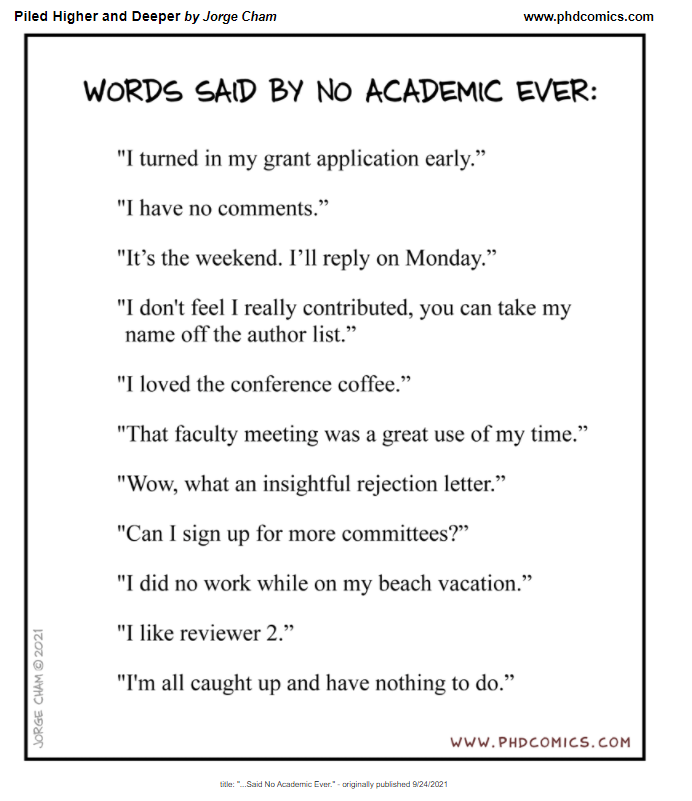

# 431 Class 12: 2021-09-30

[Main Website](https://thomaselove.github.io/431/) | [Course Calendar](https://thomaselove.github.io/431/calendar.html) | [Syllabus](https://thomaselove.github.io/431-2021-syllabus/) | [Course Notes](https://thomaselove.github.io/431-notes/) | [Piazza & TA Office Hours](https://thomaselove.github.io/431/contact.html) | [Canvas](https://canvas.case.edu) | [Data and Code](https://github.com/THOMASELOVE/431-data)
:-----------: | :--------------: | :----------: | :---------: | :-------------: | :-----------: | :------------:
for everything | for deadlines | expectations | from Dr. Love | ways to get help | labs & recordings | for downloads

In my little poll on Piazza last week. I asked which of the ten movies I listed would be the one seen by more of you than the others. 

Film | Rank on Piazza | Actual "Yes"
---- | :--------------: | :--------------:
The Matrix | 1st (17 votes) | 39
Lord of the Rings: The Fellowship of the Ring | 2nd (8 votes) | **45**
The Shawshank Redemption | Tied 3rd (4 votes) | 33
The Princess Bride | Tied 3rd (4 votes) | 25
Pulp Fiction | Tied 3rd (4 votes) | 26
The Silence of the Lambs | Tied 6th (1 vote) | 36
Spirited Away | Tied 6th (1 vote) | 27
Soul | Tied 6th (1 vote) | 11
Moonlight | Tied 6th (1 vote) | 7
Memento | 10th (0 votes) | 20

## Today's Slides

- Dr. Love's slides will be available in [PDF format], as well as in [R Markdown].
- The recording will be made available approximately 24 hours after class through our Shared Google Drive and via Modules and Echo 360 on [Canvas](https://canvas.case.edu).

## Announcements

1. Feedback on the [Minute Paper after Class 11](https://bit.ly/431-2021-min11-feedback) is now available.
2. Instructions for [Lab 4](https://github.com/THOMASELOVE/431-2021/blob/main/labs/lab04/lab04.md) are now available. It's due 2021-10-11 at 9 PM, which is the same time as the Project A Proposal. Note that in order to do Lab 4, you'll need to read [Finally, A Formula for Decoding Health News](https://fivethirtyeight.com/features/a-formula-for-decoding-health-news/) by Jeff Leek at FiveThirtyEight, but otherwise, you can do it now.
3. Instructions for [Lab 5](https://github.com/THOMASELOVE/431-2021/tree/main/labs/lab05), [Lab 6](https://github.com/THOMASELOVE/431-2021/tree/main/labs/lab06) and [Lab 7](https://github.com/THOMASELOVE/431-2021/tree/main/labs/lab07) are also now available. Labs 5 and 6 include issues we haven't yet touched on in class and reading additional Chapters in Spiegelhalter.
4. Instructions for [Lab X](https://github.com/THOMASELOVE/431-2021/tree/main/labs/labX) are also available, and you can do this lab now, or at any time before the December deadline posted in the [Course Calendar](https://thomaselove.github.io/431/calendar.html) for substantial extra credit.

## On Project A Proposals

1. Project A proposals completed prior to Friday 2021-10-01 at NOON should be submitted to the **Project A proposal (for EARLY REVIEW ONLY)** link now available on [Canvas](https://canvas.case.edu). 
2. We will review these proposals by 2021-10-06, and either accept them as is or provide some guidance as to what sort of revision is required. 
    - If your score on Canvas for this version of your proposal is 25/25, then your proposal is accepted. 
    - Otherwise, your score posted to Canvas will be the count (out of the 13 things we are evaluating in the proposals) that you have successfully completed, and you will need to REDO the proposal. 
    - You'll need to submit that revised proposal to the main link (not the Early Review one) that will appear for Project A proposals on 2021-10-02 (called *Project A Proposal Submiission for 2020-10-11 Deadline*). That revised proposal will count as your first attempt for grading purposes.
3. The list of 13 things we're looking at is provided to you on our Shared Google Drive, in a Google Doc called **Project A Proposal Checklist**.
    - The most common problems people have so far are (1) not carefully identifying the *outcome* variable within the codebook and (2) removing missing values from the data.
4. Again, the main deadline for Project A proposals will be 2021-10-11 at 9 PM (the same time as Lab 4 is due), and the link for those proposal submissions will appear on Canvas on 2021-10-02.

## On Quiz 1

1. All materials for [Quiz 1](https://github.com/THOMASELOVE/431-2021/tree/main/quizzes/quiz1) will be [available at this link](https://github.com/THOMASELOVE/431-2021/tree/main/quizzes/quiz1).
2. Quiz 1 answers must be submitted via the Quiz 1 Answer Sheet Google Form by Monday 2021-10-04 at 9 PM. No late submissions will be accepted.
3. There are only two ways to get answers to questions about Quiz 1
  - Submit a private question on [Piazza](https://piazza.com/case/fall2021/pqhs431). Public posts will be closed as of class time today until Tuesday morning.
  - Submit an email to `431-help at case dot edu`.

## Favorite Movies

We'll return to the favorite movies data for our [second breakout activity](https://github.com/THOMASELOVE/431-2021/blob/main/classes/movies/breakout2.md) in today's class.

## One Last Thing

 ["Said No Academic Ever" link](http://phdcomics.com/comics/archive_print.php?comicid=2048)
