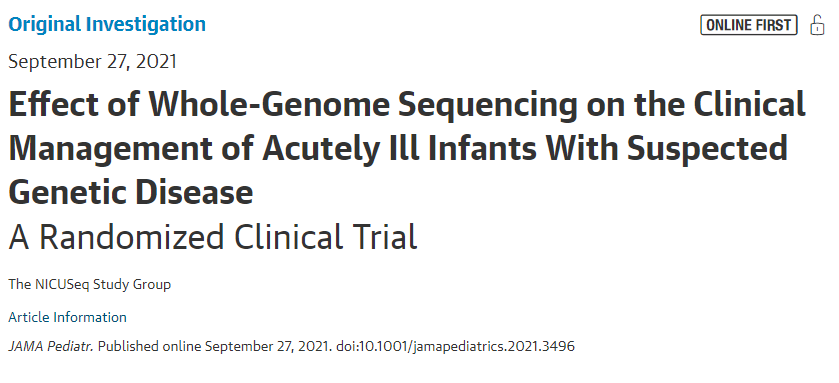
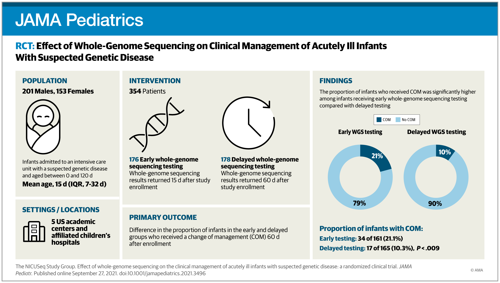

## Today's R Setup

```{r, message = FALSE}
knitr::opts_chunk$set(comment=NA) # as always
options(width = 55) # to fit things on the slides

library(Epi) # for twoby2() function
library(mosaic) # not usually something we load
library(readxl) # to import an Excel file
library(pwr) # specialized power functions
library(broom)
library(janitor)
library(knitr)
library(magrittr)
library(tidyverse)

source("data/Love-boost.R") # for twobytwo() function

theme_set(theme_bw())
```

## Today's Agenda

- Confidence Intervals for a Population Proportion
  - Five Methods to Accomplish This Task
- Comparing Two Proportions using Independent Samples
  - Standard Epidemiological Format
  - Working with 2x2 Tables
  - Note: we'll discuss paired samples comparisons in 432
- Power Calculations for Comparing Two Proportions
  - With `power.prop.test` for balanced designs
  - With the `pwr` package for unbalanced designs

# Confidence Intervals for a Population Proportion

## Moving on from Means to Proportions

We've focused on creating statistical inferences about a population mean when we have a quantitative outcome. Now, we'll tackle a **categorical** outcome. 

We'll estimate a confidence interval around an unknown population proportion, or rate, symbolized with $\pi$, on the basis of a random sample of *n* observations from the population of interest.

The sample proportion is called $\hat{p}$, which is sometimes, unfortunately, symbolized as $p$. 

- This $\hat{p}$ is the sample proportion - not a *p* value.

## An Example from *JAMA Pediatrics*



## Outcome: Change in Management (COM)

The study involved infants ages 0-120 days admitted to an intensive care unit with a suspected genetic disease.

- For our first example, we focus on a sample of 326 subjects who received whole-genome sequencing testing at some point in the first 60 days after they were enrolled in the study.
- The outcome of interest is whether or not the subject received a change of management (COM) 60 days after their enrollment.

What can we conclude about the true proportion in the population of infants who meet our study criteria who would have a COM?

## Loading the Data

```{r}
nicu <- read_excel("data/nicu_seq.xls") %>%
  clean_names()

head(nicu, 3)
```

```{r}
nicu %>% tabyl(outcome) %>% adorn_totals()
```

## A Confidence Interval for a Proportion

Our first inferential goal will be to produce a **confidence interval for the true (population) proportion** receiving a COM, across all infants who meet study criteria, based on this sample of 326 infants.

A 100(1-$\alpha$)% confidence interval for the population proportion $\pi$ can be created by using the standard normal distribution, the sample proportion, $\hat{p}$, and the standard error of a sample proportion, which is defined as the square root of $\hat{p}$ multiplied by $(1 - \hat{p})$ divided by the sample size, $n$. 

Specifically, that confidence interval estimate is $\hat{p} \pm Z_{\alpha/2} \sqrt{\frac{\hat{p}(1-\hat{p})}{n}}$

where $Z_{\alpha/2}$ = the value from a standard Normal distribution cutting off the top $\alpha/2$ of the distribution, obtained in R by substituting the desired $\alpha/2$ value into: `qnorm(alpha/2, lower.tail=FALSE)`.

- *Note*: This interval is reasonably accurate so long as $n \hat{p}$ and $n(1- \hat{p})$ are each at least 5.

## Estimating $\pi$ in the NICU data

- We'll build a 95% confidence interval for the true population proportion, so $\alpha$ = 0.05
- We have n = 326 subjects 
- Sample proportion is $\hat{p}$ = .156, since 51/326 = 0.156.

The standard error of that sample proportion will be

$$
\textrm{SE}(\hat{p}) = \sqrt{\frac{\hat{p}(1 - \hat{p})}{n}} = \sqrt{\frac{0.156(1-0.156)}{326}} = 0.020
$$ 

## Confidence Interval for $\pi$ = Pr(COM)

Our 95% confidence interval for the true population proportion, $\pi$, of infants who have a COM within 60 days is:

$$
\hat{p} \pm Z_{.025} \sqrt{\frac{\hat{p}(1 - \hat{p})}{n}} = 0.156 \pm 1.96 (0.020) = 0.156 \pm 0.039
$$

or (0.117, 0.195).

To verify that $Z_{0.025} = 1.96$...

```{r z for 0.025}
qnorm(0.025, lower.tail=FALSE)
```

## Likely Accuracy of this Confidence Interval?

Since $n \hat{p} = (326)(0.156) = 51$ and $n (1 - \hat{p}) = (326)(1-0.156) = 275$ are substantially greater than 5, the CI should be reasonably accurate.

What can we conclude from this analysis?

- Point estimate of the population proportion with COM is 0.156
- 95% confidence interval for the population proportion is (0.117, 0.195) 

What is the "margin of error" in this confidence interval?

- The entire confidence interval has width 0.078 (or 7.8 percentage points.)
- The margin of error (or half-width) is 0.039, or 3.9 percentage points.

Happily, that's our last "by hand" calculation.

## Using R to estimate a CI for a Proportion

I'll discuss five procedures for estimating a confidence interval for a population proportion. Each can be obtained using the `binom.test` function from within the `mosaic` package. For a 95% CI, we use:

```{r, message = FALSE, eval = FALSE}
mosaic::binom.test(x = 51, n = 326, 
                   p = 0.5, conf.level = 0.95, # defaults
                   ci.method = "XXX")
```

where the appropriate `ci.method` is obtained from the table below.

Approach | `ci.method` to be used
------- | ----------------------
Wald | "Wald"
Clopper-Pearson | "Clopper-Pearson" or "binom.test"
Score | "Score" or "prop.test"
Agresti-Coull | "agresti-coull"
Plus4 | "plus4"

## These 5 Approaches (each is approximate)

1. **Wald** is the "basic biostatistics" method we just calculated, where we estimate the standard error using the sample proportion and then use the Normal distribution to set the endpoints. The Wald interval is always symmetric, and can dip below 0 or above 1.
2. **Clopper-Pearson** is used by `stats::binom.test()` in R as well. It guarantees coverage at least as large as the nominal coverage rate, but may produce wider intervals than the other methods.
3. **Score** is used by `stats::prop.test()` and creates CIs by inverting p-values from score tests. It can be applied with a continuity correction (use ci.method = "prop.test") or without.
4. **Agresti-Coull** is the Wald method after adding Z successes and Z failures to the data, where Z is the appropriate quantile for a standard Normal distribution (1.96 for a 95% CI)
5. **Plus4** is the Wald method after adding 2 successes and 2 failures (so 4 observations) to the data.

Formulas? See Wikipedia's entry: Binomial proportion confidence interval

## Method 1: The Wald Procedure

```{r}
method1 <- binom.test(x = 51, n = 326, conf.level = 0.95, 
                   ci.method = "Wald")
```

```{r, eval = FALSE}
method1
```

```
Exact binomial test (Wald CI)

data:  51 out of 326
number of successes = 51, number of trials = 326, 
                                        p-value < 2.2e-16
alternative hypothesis: true probability of success 
                                is not equal to 0.5
95 percent confidence interval: 0.1170075 0.1958759
sample estimates: probability of success  0.1564417 
```


## Tidying up a `binom.test` result from `mosaic`

```{r}
tidy1 <- tidy(method1)

tidy1 %>% 
  select(estimate, conf.low, conf.high, statistic, parameter) %>% 
  kable(dig = 4)
```


## Method 2: The Clopper-Pearson Procedure

```{r}
method2 <- binom.test(x = 51, n = 326, conf.level = 0.95, 
                   ci.method = "Clopper-Pearson")

tidy2 <- tidy(method2)

tidy2 %>% 
  select(estimate, conf.low, conf.high, statistic, parameter) %>% 
  kable(dig = 4)
```

## Method 3: The Score Procedure

```{r}
method3 <- binom.test(x = 51, n = 326, conf.level = 0.95, 
                   ci.method = "Score")

tidy3 <- tidy(method3)

tidy3 %>% 
  select(estimate, conf.low, conf.high, statistic, parameter) %>% 
  kable(dig = 4)
```


## Method 4: The Agresti-Coull Procedure

```{r}
method4 <- binom.test(x = 51, n = 326, conf.level = 0.95, 
                   ci.method = "agresti-coull")

tidy4 <- tidy(method4)

tidy4 %>% 
  select(estimate, conf.low, conf.high, statistic, parameter) %>% 
  kable(dig = 4)
```

## Method 5: The Plus4 Procedure

```{r}
method5 <- binom.test(x = 51, n = 326, conf.level = 0.95, 
                   ci.method = "plus4")

tidy5 <- tidy(method5)

tidy5 %>% 
  select(estimate, conf.low, conf.high, statistic, parameter) %>% 
  kable(dig = 4)
```

## Comparison of Methods 

```{r}
res1 <- tidy1 %>% select(estimate, conf.low, conf.high)
res2 <- tidy2 %>% select(estimate, conf.low, conf.high)
res3 <- tidy3 %>% select(estimate, conf.low, conf.high)
res4 <- tidy4 %>% select(estimate, conf.low, conf.high)
res5 <- tidy5 %>% select(estimate, conf.low, conf.high)

res <- bind_rows(res1, res2, res3, res4, res5)
res <- res %>% mutate(
  approach = c("Wald", "Clopper-Pearson", "Score", 
               "Agresti-Coull", "Plus4"))
```

## Results with too many decimal places

95% confidence intervals based on x = 51 successes in n = 326 trials.

```{r}
res %>% kable(dig = 5)
```

This is way more precision than we can really justify, but I just want you to see that the five results are all (slightly) different.

## Results after some rounding

95% confidence intervals based on x = 51 successes in n = 326 trials.

```{r}
res %>% kable(dig = 3)
```

Here's a somewhat more plausible rounding approach. 

- Is the distinction between methods important in this scenario?

## Plotting the 95% CI Estimates

```{r, fig.height = 4}
ggplot(res, aes(x = approach, y = estimate)) +
  geom_point() +
  geom_errorbar(aes(ymin = conf.low, ymax = conf.high)) + 
  coord_flip() +
  labs(title = "95% CIs for x = 51, n = 326")
```

## What if we ran 90% Confidence Intervals Instead?

90% confidence intervals based on x = 51 successes in n = 326 trials. 

```{r, echo = FALSE}
new1 <- tidy(binom.test(x = 51, n = 326, conf.level = 0.9, ci.method = "Wald")) %>% select(estimate, conf.low, conf.high) %>% mutate(approach = "Wald")
new2 <- tidy(binom.test(x = 51, n = 326, conf.level = 0.9, ci.method = "Clopper-Pearson")) %>% select(estimate, conf.low, conf.high) %>% mutate(approach = "Clopper-Pearson")
new3 <- tidy(binom.test(x = 51, n = 326, conf.level = 0.9, ci.method = "Score")) %>% select(estimate, conf.low, conf.high) %>% mutate(approach = "Score")
new4 <- tidy(binom.test(x = 51, n = 326, conf.level = 0.9, ci.method = "agresti-coull")) %>% select(estimate, conf.low, conf.high) %>% mutate(approach = "Agresti-Coull")
new5 <- tidy(binom.test(x = 51, n = 326, conf.level = 0.9, ci.method = "plus4")) %>% select(estimate, conf.low, conf.high) %>% mutate(approach = "Plus4")

newres <- bind_rows(new1, new2, new3, new4, new5)

newres %>% kable(dig = 3)
```

- I've hidden the code here, but it's available in the R Markdown.

## Plotting the 90% CI Estimates

```{r, echo = FALSE}
ggplot(newres, aes(x = approach, y = estimate)) +
  geom_point() +
  geom_errorbar(aes(ymin = conf.low, ymax = conf.high)) + 
  coord_flip() +
  labs(title = "90% CIs for x = 51, n = 326")
```

## Estimating Rates More Accurately

Suppose you have some data involving n independent tries, with x successes. The most natural estimate of the "success rate" in the data is x / n. But, strangely enough, it turns out this isn't an entirely satisfying estimator. Alan Agresti provides substantial motivation for $\frac{x + 2}{n + 4}$ as an alternative\footnote{See http://andrewgelman.com/2007/05/15 for instance.}. We'll call this a *Bayesian augmentation*.

Estimates with and without the augmentation will be generally comparable, so long as... 

a. the sample size is more than, say, 30 subjects, and/or 
b. the sample probability of the outcome is between 0.1 and 0.9

## What if we'd had 2 successes in 25 trials instead?

90% confidence intervals based on x = 2 successes in n = 25 trials. 

```{r, echo = FALSE}
anew1 <- tidy(binom.test(x = 2, n = 25, conf.level = 0.9, ci.method = "Wald")) %>% select(estimate, conf.low, conf.high) %>% mutate(approach = "Wald")
anew2 <- tidy(binom.test(x = 2, n = 25, conf.level = 0.9, ci.method = "Clopper-Pearson")) %>% select(estimate, conf.low, conf.high) %>% mutate(approach = "Clopper-Pearson")
anew3 <- tidy(binom.test(x = 2, n = 25, conf.level = 0.9, ci.method = "Score")) %>% select(estimate, conf.low, conf.high) %>% mutate(approach = "Score")
anew4 <- tidy(binom.test(x = 2, n = 25, conf.level = 0.9, ci.method = "agresti-coull")) %>% select(estimate, conf.low, conf.high) %>% mutate(approach = "Agresti-Coull")
anew5 <- tidy(binom.test(x = 2, n = 25, conf.level = 0.9, ci.method = "plus4")) %>% select(estimate, conf.low, conf.high) %>% mutate(approach = "Plus4")

anewres <- bind_rows(anew1, anew2, anew3, anew4, anew5)

anewres %>% kable(dig = 3)
```

## 90% CI Estimates for x = 2, n = 25

```{r, echo = FALSE}
ggplot(anewres, aes(x = approach, y = estimate)) +
  geom_point() +
  geom_errorbar(aes(ymin = conf.low, ymax = conf.high)) + 
  geom_hline(aes(yintercept = 0), col = "red", lty = "dashed") +
  coord_flip() +
  labs(title = "90% CIs for x = 2, n = 25")
```

## What if x = 0 or x = n?

The **Rule of Three** approach is often used.

- An approximate 95% CI for the proportion in a setting where x = 0 in n trials is $(0, \frac{3}{n})$

- An approximate 95% CI for the proportion where x = n in n trials is $(1 - \frac{3}{n}, 1)$


# Comparing Population Proportions

## Comparing Population Proportions

Suppose we want to compare the population proportions $\pi_1$ and $\pi_2$, based on samples of sizes $n_1$ and $n_2$. We can do this using independent samples or using paired samples.

1. The individual observations in exposure group 1 are not linked/matched to individual observations in exposure group 2. (Independent Samples)
2. Each individual observation in exposure group 1 is linked or matched to a specific observation in exposure group 2. (Paired Samples) 

The determination as to whether the study design creates paired or independent samples can be determined without summarizing the data. It's a function of the design, not the responses.

## A Polling Example

- 200 adult Ohio residents agreed to participate in a poll both two months ago and again today. Each of the 200 people met the polling organization's standards for a "likely voter in the 2020 presidential election". 100 of those polled were under the age of 50 and the rest were 50 or older.
- In between the two polls, a major news event occurred which was relevant to Candidate X.

We asked them the same question at both times: "Are you considering voting for Candidate X?" We are interested in understanding what the data tell us about:

1. Were people under age 50 more likely to be considering Candidate X than people ages 50 and higher?
2. Were people more likely to be considering Candidate X after the news event than before? 

Which of these uses *independent* samples, and which *paired* samples?

# Comparing Proportions using Independent Samples 

## Visual Abstract for the NICU Sequencing Paper

```{r, echo = FALSE, fig.align = "center", out.width = '90%'}

```

## NICU Sequencing Example

Let's compare the proportion who have a COM between:

- Group 1: infants tested early (15 d after enrollment)
- Group 2: infants tested later (60 d after enrollment)

```{r}
nicu %>%
  count(interv, outcome) %>% kable()
```

- How might we rearrange this information? Exposure? Outcome?

## The Table We'd Like To Get To

Let's compare the proportion who have a COM between:

- Group 1: infants tested early (at 15 d)
- Group 2: infants tested later (delayed to 60 d)

### Standard Epidemiological Format

- rows are the exposure
- columns are the outcome

What do we want in our setting?

## Our Goal: Standard Epidemiological Format

- exposure is *intervention* (15 or 60 days)
- columns are *outcome* category (COM, No COM)

```

                 COM       No COM
Early (15 d)      a          b
Delayed (60 d)    c          d
```

## Our 2 x 2 Table

```{r}
nicu %>% tabyl(interv, outcome)
```

- Is this in standard epidemiological format, with the rows indicating the exposure, and the columns indicating the outcome, and the correct count in the top left cell?

## Switching the Rows

We want Early (15) to come first, before Delayed (60):

```{r}
nicu <- nicu %>%
  mutate(interv = fct_relevel(interv, "Early (15)"))

nicu %>% tabyl(interv, outcome)
```

## Adding Totals

```{r}
nicu %>% tabyl(interv, outcome) %>% 
  adorn_totals(where = c("row", "col"))
```

- How many subjects do we have in each exposure group?
- How many subjects fall into each outcome group?

Can we augment the table to help us understand:

- What is the probability of achieving each of the two possible outcomes?
- How do the outcome probabilities differ by exposure group?

## Augmenting the Table

```{r}
nicu %>% tabyl(interv, outcome) %>% 
  adorn_totals(where = c("row", "col")) %>%
  adorn_percentages(denom = "row") %>%
  adorn_pct_formatting(digits = 1) %>%
  adorn_ns(position = "front")
```

- Why am I using `denom = "row"` here?

> Among these subjects, compare the proportion of early (15 d) tested infants with COM to the proportion of late (60 d) tested infants with COM.

- What are the sample estimates for the two rates I am comparing?

## 2 x 2 Table: Comparing Probabilities

-- | COM | No COM | *Total*
:------------: | ---: | ---: | -----:
Early (15)   | 34 | 127 | *161*
Delayed (60) | 17 | 148 | *165*
*Total*         | *51* | *275* | *326*

- Pr(COM | Early) = 34/161 = `r round_half_up(34/161, 3)`
- Pr(COM | Delayed) = 17/165 = `r round_half_up(17/165, 3)`
- The ratio of those two probabilities (risks) is `r round_half_up(34/161, 3)`/`r round_half_up(17/165, 3)` = `r round((34/161)/(17/165), 3)`.

Can we build a confidence interval for the relative risk of COM now in the early tested infants as compared to the delayed tested infants?

- The difference in those risks is `r round_half_up(34/161, 3)` - `r round_half_up(17/165, 3)` = `r round_half_up(34/161 - 17/165, 3)`.

How about a confidence interval for the risk difference, too?

## 2 x 2 Table for NICU Example, Odds Ratio

-- | COM | No COM | *Total*
:------------: | ---: | ---: | -----:
Early (15)   | 34 | 127 | *161*
Delayed (60) | 17 | 148 | *165*
*Total*         | *51* | *275* | *326*

- Odds = Probability / (1 - Probability)
- Sample Odds of COI if Early = $\frac{34/161}{1 - (34/161)}$ = `r round_half_up((34/161)/(1-(34/161)), 3)`
- Sample Odds of COI if Delayed = $\frac{17/165}{1 - (17/165)}$ = `r round_half_up((17/165)/(1-(17/165)), 3)`
- Ratio of these two Odds are `r round_half_up(((34/161)/(1-(34/161))) / ((17/165)/(1-(17/165))),3)`.

In a 2x2 table, odds ratio = cross-product ratio.

- Here, the cross-product estimate = $\frac{34*148}{17*127}$ = `r round_half_up(34*148/(17*127),3)`.

Can we build a confidence interval for the population odds ratio for COM given "early" as compared to "delayed" testing?

## Using `twoby2` from the `Epi` package

Once we have set up the factors for `interv` and `outcome` so that the table we produce is in standard epidemiological format, we can plug it into the `twoby2` function from the `Epi` package.

```{r, eval = FALSE}
twoby2(nicu %$% table(interv, outcome))
```

Results shown on next slide.

## `twoby2(nicu %$% table(interv, outcome))` results

```{r, echo = FALSE}
twoby2(nicu %$% table(interv, outcome))
```


## Using `twobytwo` from the `Love-boost.R` script

-- | COM | No COM | *Total*
:------------: | ---: | ---: | -----:
Early (15)   | 34 | 127 | *161*
Delayed (60) | 17 | 148 | *165*
*Total*         | *51* | *275* | *326*

Code we need is:

```{r, message = FALSE, eval = FALSE}
twobytwo(34, 127, 17, 148,  # note order of counts
      "Early", "Delayed", # names of the rows
      "COM", "NoCOM",  # names of the columns
      conf.level = 0.99)  # default is 95% confidence
```

Complete Output shown on the next slide

---

```
2 by 2 table analysis: 
------------------------------------------------------ 
Outcome   : COM 
Comparing : Early vs. Delayed 

        COM NoCOM    P(COM) 99% conf. interval
Early    34   127    0.2112    0.1400   0.3057
Delayed  17   148    0.1030    0.0561   0.1818

                                   99% conf. interval
             Relative Risk: 2.0497    1.0078   4.1688
         Sample Odds Ratio: 2.3307    1.0202   5.3245
Conditional MLE Odds Ratio: 2.3247    0.9919   5.7786
    Probability difference: 0.1081    0.0037   0.2125

             Exact P-value: 0.0092 
        Asymptotic P-value: 0.0083 
------------------------------------------------------
```

## Another Way to Create The Table

Suppose we didn't have the data, just the visual abstract.

```{r}
t1 <- matrix(c(34, 127, 17, 148), byrow = TRUE, nrow = 2)
rownames(t1) <- c("Early", "Delayed")
colnames(t1) <- c("COM", "No_COM")
addmargins(t1)
```

## Hypothesis Testing?

The hypotheses being compared can be thought of in several ways...

- $H_0$: $\pi_1 = \pi_2$, vs. $H_A$: $\pi_1 \neq \pi_2$.
- $H_0$: Pr(COM | Early) = Pr(COM | Delayed) vs. $H_A$: Pr(COM | Early) $\neq$ Pr(COM | Delayed).
- $H_0$: rows and columns of the table are *independent*, in that the probability of COM in each row is the same vs. $H_A$: the rows and columns of the table are *associated*.

```
   Exact P-value: 0.0092 
Asymptotic P-value: 0.0083 
```

- The `Exact P-value` comes from Fisher's exact test, and is technically exact only if we treat the row and column totals as being fixed.
- The `Asymptotic P-value` comes from a Pearson $\chi^2$ test.
- Neither approach is helpful if we don't have sufficient data to justify inference in the first place.

## Bayesian Augmentation in a 2x2 Table?

Original command:

```{r, eval = FALSE}
twobytwo(34, 127, 17, 148, 
         "Early", "Delayed", "COM", "NoCOM", 
         conf.level = 0.99)
```

Bayesian augmentation approach: Add two successes and add two failures in each row...

```{r, eval = FALSE}
twobytwo(34+2, 127+2, 17+2, 148+2,  
      "Early", "Delayed", "COM", "NoCOM", 
      conf.level = 0.99)  
```

Output shown on next slide.

---

```
2 by 2 table analysis: 
------------------------------------------------------ 
Outcome   : COM 
Comparing : Early vs. Delayed 

        COM NoCOM    P(COM) 99% conf. interval
Early    36   129    0.2182    0.1466   0.3120
Delayed  19   150    0.1124    0.0634   0.1917

                                   99% conf. interval
             Relative Risk: 1.9407    0.9893   3.8071
         Sample Odds Ratio: 2.2032    0.9967   4.8701
Conditional MLE Odds Ratio: 2.1980    0.9691   5.2348
    Probability difference: 0.1058    0.0004   0.2105

             Exact P-value: 0.0118 
        Asymptotic P-value: 0.0103 
------------------------------------------------------
```

## Tuberculosis Prevalence Among IV Drug Users

Suppose now that we are investigating factors affecting tuberculosis prevalence among intravenous drug users.

We collect the following information:

- Among 97 individuals who admit to sharing needles, 
    - 24 (24.7%) had a positive tuberculin skin test result.
- Among 161 drug users who deny sharing needles, 
    - 28 (17.4%) had a positive test result.  

What does the 2x2 table look like?

## Tuberculosis Prevalence Among IV Drug Users

Among 97 individuals who admit to sharing needles, 24 (24.7%) had a positive tuberculin skin test result; among 161 drug users who deny sharing needles, 28 (17.4%) had a positive test result.  

The 2x2 Table is...

```
         TB+   TB-
share     24    73
don't     28   133
```

- rows describe needle sharing, columns describe TB test result
- row 1 people who share needles: 24 TB+, and 97-24 = 73 TB-
- row 2 people who don't share: 28 TB+ and 161-28 = 133 TB-


## `twobytwo` (with Bayesian Augmentation)

To start, we'll test the null hypothesis that the population proportions of intravenous drug users who have a positive tuberculin skin test result are identical for those who share needles and those who do not.

$$
H_0: \pi_{share} = \pi_{donotshare} 
$$ 
$$
H_A: \pi_{share} \neq \pi_{donotshare}
$$

We'll use the Bayesian augmentation.

```{r twobytwo for TB, eval=FALSE}
twobytwo(24+2, 73+2, 28+2, 133+2, 
         "Sharing", "Not Sharing", 
         "TB test+", "TB test-")
```

## Two-by-Two Table Result
```
Outcome   : TB test+ 
Comparing : Sharing vs. Not Sharing 

          TB test+ TB test- P(TB test+) 95% conf. int.
Sharing         26       75     0.2574  0.1816 0.3513
Not Sharing     29      134     0.1818  0.1301 0.2482

                                   95% conf. interval
             Relative Risk: 1.4158    0.8910   2.2498
         Sample Odds Ratio: 1.5600    0.8594   2.8318
Conditional MLE Odds Ratio: 1.5572    0.8189   2.9511
    Probability difference: 0.0756   -0.0244   0.1819

Exact P-value: 0.1638      Asymptotic P-value: 0.1438 
```
What conclusions should we draw?

## Designing a New TB Study

PI:

- OK. That's a nice pilot. 
- We saw $p_{nonshare}$ = 0.18 and $p_{share}$ = 0.26 after your augmentation. 
- Help me design a new study. 
    - This time, let's have as many needle-sharers as non-sharers. 
    - We should have 90% power to detect a difference almost as large as what we saw in the pilot, or larger, so a difference of 6 percentage points.
    - We'll use a two-sided test, and $\alpha$ = 0.05, of course.

What sample size would be required to accomplish these aims?

## How `power.prop.test` works

`power.prop.test` works much like the `power.t.test` we saw for means. 

Again, we specify 4 of the following 5 elements of the comparison, and R calculates the fifth.

- The sample size (interpreted as the # in each group, so half the total sample size)
- The true probability in group 1
- The true probability in group 2
- The significance level ($\alpha$)
- The power (1 - $\beta$)

The big weakness with the `power.prop.test` tool is that it doesn't allow you to work with unbalanced designs.

## Using `power.prop.test` for Balanced Designs

To find the sample size for a two-sample comparison of proportions using a balanced design:

- we will use a two-sided test, with $\alpha$ = .05, and power = .90, 
- we estimate that non-sharers have probability .18 of positive tests, 
- and we will try to detect a difference between this group and the needle sharers, who we estimate will have a probability of .24

### Finding the required sample size in R

```{r, eval=FALSE}
power.prop.test(p1 = .18, p2  = .24, 
                alternative = "two.sided",
                sig.level = 0.05, power = 0.90)
```

Any guess as to needed sample size?

## Results: `power.prop.test` for Balanced Design

```{r, eval=FALSE}
power.prop.test(p1 = .18, p2  = .24, 
                alternative = "two.sided",
                sig.level = 0.05, power = 0.90)
```

```
Two-sample comparison of proportions power calculation 
n = 966.3554
p1 = 0.18, p2 = 0.24
sig.level = 0.05, power = 0.9, alternative = two.sided
NOTE: n is number in *each* group
```
So, we'd need at least 967 non-sharing subjects, and 967 more who share needles to accomplish the aims of the study, or a total of 1934 subjects.

## Another Scenario

Suppose we can get 400 sharing and 400 non-sharing subjects.  How much power would we have to detect a difference in the proportion of positive skin test results between the two groups that was identical to the pilot data above or larger, using a *one-sided* test, with $\alpha$ = .10?

```{r powerprop2, eval=FALSE}
power.prop.test(n=400, p1=.18, p2=.26, sig.level = 0.10,
                alternative="one.sided")
```

```
Two-sample comparison of proportions power calculation 
n = 400, p1 = 0.18, p2 = 0.26
sig.level = 0.1, power = 0.9273602
alternative = one.sided
NOTE: n is number in *each* group
```

We would have just over 92.7% power to detect such an effect.

## Using the `pwr` package to assess sample size for Unbalanced Designs

The `pwr.2p2n.test` function in the `pwr` package can help assess the power of a test to determine a particular effect size using an unbalanced design, where $n_1$ is not equal to $n_2$. 

As before, we specify four of the following five elements of the comparison, and R calculates the fifth.

- `n1` = The sample size in group 1
- `n2` = The sample size in group 2
- `sig.level` = The significance level ($\alpha$)
- `power` = The power (1 - $\beta$)
- `h` = the effect size h, which can be calculated separately in R based on the two proportions being compared: $p_1$ and $p_2$.

## Calculating the Effect Size `h`

To calculate the effect size for a given set of proportions, use `ES.h(p1, p2)` which is available in the `pwr` package.

For instance, comparing .18 to .25, we have the following effect size.

```{r pwrprop es}
ES.h(p1 = .18, p2 = .25)
```

## Using `pwr.2p2n.test` in R

Suppose we can have 700 samples in group 1 (the not sharing group) but only 400 in group 2 (the group of users who share needles). 

How much power would we have to detect the distinction between p1 = .18, p2 = .25 with a 5% significance level in a two-sided test?

### R Command to find the resulting power

```{r, eval=FALSE}
pwr::pwr.2p2n.test(h = ES.h(p1 = .18, p2 = .25), 
              n1 = 700, n2 = 400, sig.level = 0.05)
```

## Results of using `pwr.2p2n.test`

```{r, eval=FALSE}
pwr::pwr.2p2n.test(h = ES.h(p1 = .18, p2 = .25), 
              n1 = 700, n2 = 400, sig.level = 0.05)
```

```
difference of proportion power calculation 
for binomial distribution (arcsine transformation) 

h = 0.1708995, n1 = 700, n2 = 400
sig.level = 0.05, power = 0.7783562
alternative = two.sided
NOTE: different sample sizes
```

We will have just under 78% power under these circumstances.

## Comparison to Balanced Design

How does this compare to the results with a balanced design using 1100 drug users in total, i.e. with 550 patients in each group?

```{r pwrprop calc2, eval=FALSE}
pwr::pwr.2p2n.test(h = ES.h(p1 = .18, p2 = .25), 
              n1 = 550, n2 = 550, sig.level = 0.05)
```

which yields a power estimate of 0.809. Or we could instead have used...

```{r powerprop calc2-a, eval=FALSE}
power.prop.test(p1 = .18, p2 = .25, sig.level = 0.05, 
                n = 550)
```

which yields an estimated power of 0.808.

Each approach uses approximations, and slightly different ones, so it's not surprising that the answers are similar, but not identical.

## What haven't I included here?

1. Some people will drop out.
2. What am I going to do about missing data?
3. What if I want to do my comparison while adjusting for covariates?

## How Big A Sample Size Do I need?

1. What is the budget?

2. What are you trying to compare?

3. What is the study design?

4. How big an effect size do you expect (hope) to see?

5. What was that budget again?

6. OK, tell me the maximum allowable rates of Type I and Type II error that you want to control for. Or, if you like, tell me the confidence level and power you want to have.

7. And what sort of statistical inference do you want to plan for?

## Coming Soon

Classes 17-18:

- Chi-Square Testing for Larger Contingency Tables
- Analysis of Variance for Comparing > 2 Population Means
- Methods of Dealing with Multiple Comparisons
- More on Statistical Significance and the trouble with p values
- Making Sure You Can Complete Project A's Analyses

and then we return to Multiple Regression