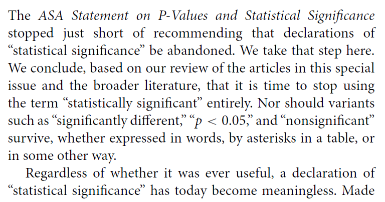
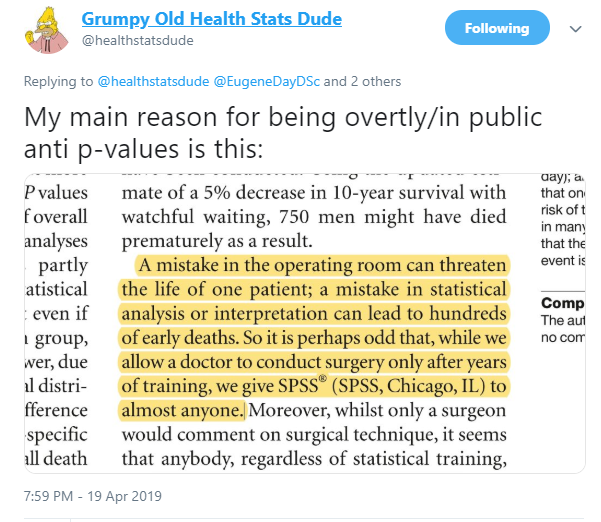

```{r setup, include=FALSE}
knitr::opts_chunk$set(comment=NA)
options(width = 55)
```

## Today's Agenda

On Contingency Tables (Chapter 24) 

- Building a $J \times K$ Table
- $\chi^2$ Tests of Independence
    - Cochran Conditions and Checking Assumptions

Replicable Research and the Crisis in Science

- ASA 2016 Statement on P values (Context, Process, Purpose)
- Is changing the *p* value cutoff the right strategy?
- Second-generation *p* values: A next step?
- ASA 2019 Statement on Statistical Inference in the 21st Century

## Today's Setup

```{r, message = FALSE}
library(janitor)
library(magrittr)
library(patchwork)
library(vcd)
library(tidyverse)

theme_set(theme_bw())
```

# Working with Larger Cross-Tabulations

## A $2 \times 3$ contingency table

This table displays the count of patients who show *complete*, *partial*, or *no response* after treatment with either **active** medication or a **placebo** in a study of 100 patients...

Group | None | Partial | Complete
-----:| :---:| :----: | :-----:
Active | 8 | 24 | 20
Placebo | 12 | 26 | 10

Is there a statistically detectable association here, at $\alpha = 0.10$? 

- $H_0$: Response Distribution is the same, regardless of Treatment.
- $H_A$: There is an association between Treatment and Response.

## The Pearson Chi-Square Test

The Pearson $\chi^2$ test assumes the null hypothesis is true (rows and columns are independent.) That is a model for our data. How does it work? Here's the table, with marginal totals added.

-- | None | Partial | Complete | **TOTAL**
-------- | ------: | -----: | -----: | -----:
Active   | 8 | 24 | 20 | **52**
Placebo  | 12 | 26 | 10 | **48**
**TOTAL** | **20** | **50** | **30** | **100**

The test needs to estimate the expected frequency in each of the six cells under the assumption of independence. If the rows and columns are in fact independent of each other, then what is the expected number of subjects that will fall in the Active/None cell?

## The Independence Model

The independence model means the overall rate of "Response = None" or "Partial" or "Complete" applies to both "Active" and "Placebo" subjects.

-- | None | Partial | Complete | **TOTAL**
---------: | ------: | -----: | -----: | -----:
Active | -- | -- | -- | **52**
Placebo | -- | -- | -- | **48**
**TOTAL** | **20** | **50** | **30** | **100**

If the rows and columns were independent, then: 

- 20/100 or 20% of subjects would have the response "None"
    - That means 20% of the 52 Active, and 20% of the 48 Placebo subjects.
- 50% would have a "Partial" response in each exposure group, and 
- 30% would have a "Complete" response in each group.

So, can we fill in the expected frequencies under our independence model?

## Observed (*Expected*) Cell Counts

-- | None | Partial | Complete | **TOTAL**
-------- | :------: | :-----: | :-----: | -----:
Active   | 8 (*10.4*) | 24 (*26.0*) | 20 (*15.6*) | **52**
Placebo  | 12 (*9.6*) | 26 (*24.0*) | 10 (*14.4*) | **48**
**TOTAL** | **20** | **50** | **30** | **100**

### General Formula for Expected Frequencies under Independence

$$ 
\mbox{Expected Frequency} = \frac{\mbox{Row total} \times \mbox{Column total}}{\mbox{Grand Total}}
$$

This assumes that the independence model holds: the probability of being in a particular column is exactly the same in each row, and vice versa.

## Chi-Square Assumptions

- Expected Frequencies: We assume that the expected frequency, under the null hypothesized model of independence, will be **at least 5** (and ideally at least 10) in each cell. If that is not the case, then the $\chi^2$ test is likely to give unreliable results. The *Cochran conditions* require us to have no cells with zero and at least 80% of the cells in our table with expected counts of 5 or higher. That's what R uses to warn you of trouble.
- Don't meet the standards? Consider collapsing categories.

### Observed (**Expected**) Cell Counts

-- | None | Partial | Complete | **TOTAL**
-------- | :------: | :-----: | :-----: | -----:
Active   | 8 (**10.4**) | 24 (**26.0**) | 20 (**15.6**) | 52
Placebo  | 12 (**9.6**) | 26 (**24.0**) | 10 (**14.4**) | 48
TOTAL | 20 | 50 | 30 | 100

## Getting the Table into R

We'll put the table into a matrix in R. Here's one approach...

```{r}
T1 <- matrix(c(8, 24, 20, 12, 26, 10), 
             ncol=3, nrow=2, byrow=TRUE)
rownames(T1) <- c("Active", "Placebo")
colnames(T1) <- c("None", "Partial", "Complete")
T1
```

## Chi-Square Test Results in R

- $H_0$: Response Distribution is the same, regardless of Treatment.
    - Rows and Columns of the table are *independent*
- $H_A$: There is an association between Treatment and Response.
    - Rows and Columns of the table are *associated*.

```{r}
chisq.test(T1)
```

What is the conclusion?

## Does Sample Size Affect The $\chi^2$ Test?

- T1 results were: $\chi^2$ = 4.0598, df = 2, *p* = 0.1313
- What if we had the same pattern, but twice as much data?

```{r}
T1_doubled <- T1*2
T1_doubled
```

```{r}
chisq.test(T1_doubled)
```

## Can we run Fisher's exact test instead?

Yes, but ... if the Pearson assumptions don't hold, then the Fisher's test is not generally an improvement. 

```{r}
fisher.test(T1)
```

- It's also really meant more for square tables, with the same number of rows as columns, and relatively modest sample sizes.

## OK. Back to `dm1000`

```{r}
dm1000 <- read_rds("data/dm_1000.Rds") %>%
    select(subject, tobacco, insurance) %>%
    filter(complete.cases(.))

head(dm1000)
```

## Arrange the Factors in a Useful Order

```{r}
dm1000 <- dm1000 %>%
    mutate(tobacco = 
               fct_relevel(tobacco, "Current", "Former"),
           insurance = 
               fct_relevel(insurance, "Medicare", 
                           "Commercial", "Medicaid"))

dm1000 %>% tabyl(tobacco, insurance) %>% 
    adorn_totals(where = c("row", "col"))
```

## What am I plotting here?

```{r, eval = FALSE, fig.height = 4}
p1 <- ggplot(dm1000, aes(x = insurance)) + geom_bar() + 
    theme_bw() + 
    geom_text(aes(label = ..count..), stat = "count", 
              vjust = 1.5, col = "white")

p2 <- ggplot(dm1000, aes(x = tobacco)) + geom_bar() + 
    theme_bw() + 
    geom_text(aes(label = ..count..), stat = "count", 
              vjust = 1.5, col = "white")

p1 + p2 
```

## dm1000: Two Categorical Variables of interest

```{r, echo = FALSE, fig.height = 4}
p1 <- ggplot(dm1000, aes(x = insurance)) + geom_bar() + 
    theme_bw() + 
    geom_text(aes(label = ..count..), stat = "count", 
              vjust = 1.5, col = "white")

p2 <- ggplot(dm1000, aes(x = tobacco)) + geom_bar() + 
    theme_bw() + 
    geom_text(aes(label = ..count..), stat = "count", 
              vjust = 1.5, col = "white")

p1 + p2 
```

## A $4 \times 3$ table with the `dm1000` data

```{r}
dm1000 %>% 
    tabyl(insurance, tobacco) %>%
    adorn_totals(where = c("row", "col"))
```

## Plotting a Cross-Tabulation?

```{r}
ggplot(dm1000, aes(x = insurance, y = tobacco)) +
    geom_count() + theme_bw()
```

## Tobacco Bar Chart faceted by Insurance

```{r, fig.height = 4}
ggplot(dm1000, aes(x = tobacco, fill = tobacco)) + 
    geom_bar() + theme_bw() + facet_wrap(~ insurance) +
    guides(fill = "none") + 
    geom_text(aes(label = ..count..), stat = "count", 
              vjust = 1, col = "black")
```

## Tobacco Status and Insurance in `dm1000`

- $H_0$: Insurance type and Tobacco status are independent
- $H_A$: Insurance type and Tobacco status have a detectable association

Pearson $\chi^2$ results?

```{r}
dm1000 %>% tabyl(insurance, tobacco) %>% chisq.test()
```

Can we check our expected frequencies?

## Checking Expected Frequencies

```{r}
res <- dm1000 %>% tabyl(insurance, tobacco) %>% chisq.test()

res$observed
res$expected
```

## Mosaic Plot for Cross-Tabulation

Each rectangle's area is proportional to the number of cases in that cell.

```{r}
dm1000 %$% plot(insurance, tobacco, ylab = "", xlab = "")
```

## Mosaic Plot from the `vcd` package (highlighting)

```{r, fig.height = 4, fig.width = 7}
mosaic(~ tobacco + insurance, data = dm1000, 
       highlighting = "tobacco", 
       highlighting_fill = c("red", "gray50", "gray80"))
```

## Mosaic Plot from the `vcd` package (with $\chi^2$ shading)

```{r}
mosaic(~ tobacco + insurance, data = dm1000, shade = TRUE)
```

# P values: What's the problem?

## Replicable Research and the Crisis in Science

- ASA 2016 Statement on P values (Context, Process, Purpose)
- Is changing the *p* value cutoff the right strategy?
- Second-generation *p* values: A next step?
- ASA 2019 Statement on Statistical Inference in the 21st Century

---


---


---


---


## Roger Peng's description of a successful data analysis

> A data analysis is successful if the audience to which it is presented accepts the results.

- "What is a Successful Data Analysis?" [$\textcolor{blue}{simplystatistics.org}$](https://simplystatistics.org/2018/04/17/what-is-a-successful-data-analysis/) (2018-04-17).

So what makes a data analysis more believable / more acceptable?


## The American Statistical Association

2016

- Ronald L. Wasserstein & Nicole A. Lazar (2016) [The ASA's Statement on p-Values: Context, Process, and Purpose](https://www.tandfonline.com/doi/full/10.1080/00031305.2016.1154108), *The American Statistician*, 70:2, 129-133, DOI: [10.1080/00031305.2016.1154108](https://doi.org/10.1080/00031305.2016.1154108)


2019

- Ronald L. Wasserstein, Allen L. Schirm & Nicole A. Lazar (2019) [Moving to a World Beyond "p < 0.05"](https://www.tandfonline.com/doi/full/10.1080/00031305.2019.1583913), *The American Statistician*, 73:sup1, 1-19, DOI: [10.1080/00031305.2019.1583913](https://doi.org/10.1080/00031305.2019.1583913). 

## Statistical Inference in the 21st Century

> ... a world learning to venture beyond "p < 0.05"

> This is a world where researchers are free to treat "p = 0.051" and "p = 0.049" as not being categorically different, where authors no longer find themselves constrained to selectively publish their results based on a single magic number. 

> In this world, where studies with "p < 0.05" and studies with "p > 0.05" are not automatically in conflict, researchers will see their results more easily replicated -- and, even when not, they will better understand why.

> The 2016 ASA Statement on P-Values and Statistical Significance started moving us toward this world. As of the date of publication of this special issue, the statement has been viewed over 294,000 times and cited over 1700 times-an average of about 11 citations per week since its release. Now we must go further.

## The American Statistical Association Statement on P values and Statistical Significance

The ASA Statement (2016) was mostly about what **not** to do.

The 2019 effort represents an attempt to explain what to do.

> Some of you exploring this special issue of The American Statistician might be wondering if it's a scolding from pedantic statisticians lecturing you about what not to dowith p-values, without
offering any real ideas of what to do about the very hard problem of separating signal from noise in data and making decisions under uncertainty. Fear not. In this issue, thanks to 43 innovative
and thought-provoking papers from forward-looking statisticians, help is on the way.

## "Don't" is not enough. 

> If you're just arriving to the debate, here's a sampling of what not to do.

- Don't base your conclusions solely on whether an association or effect was found to be "statistically significant" (i.e., the *p* value passed some arbitrary threshold such as p < 0.05).
- Don't believe that an association or effect exists just because it was statistically significant.
- Don't believe that an association or effect is absent just because it was not statistically significant.
- Don't believe that your p-value gives the probability that chance alone produced the observed association or effect or the probability that your test hypothesis is true.
- Don't conclude anything about scientific or practical importance based on statistical significance (or lack thereof).

## One More Don't...



> A label of statistical significance adds nothing to what is already conveyed by the value of *p*; in fact, this dichotomization of *p*-values makes matters worse.

## Problems with *P* Values

1. *P* values are inherently unstable
2. The *p* value, or statistical significance, does not measure the size of an effect or the importance of a result
3. Scientific conclusions should not be based only on whether a *p* value passes a specific threshold
4. Proper inference requires full reporting and transparency
5. By itself, a *p* value does not provide a good measure of evidence regarding a model or hypothesis

[$\textcolor{blue}{Link}$](http://jamanetwork.com/journals/jamaotolaryngology/fullarticle/2546529)

## Solutions to the *P* Value Problems

1. Estimation of the Size of the Effect
2. Precision of the Estimate (Confidence Intervals)
3. Inference About the Target Population
4. Determination of Whether the Results Are Compatible With a Clinically Meaningful Effect
5. Replication and Steady Accumulation of Knowledge

[$\textcolor{blue}{Link}$](http://jamanetwork.com/journals/jamaotolaryngology/fullarticle/2546529)

## Importance of Meta-Analytic Thinking

> In JAMA Otolaryngology: Head & Neck Surgery, we look to publish original investigations where the investigators planned the study with sufficient sample size to have adequate power to detect a clinically meaningful effect and report the results with effect sizes and CIs. Authors should interpret the effect sizes in relation to previous research and use CIs to help determine whether the results are compatible with clinically meaningful effects. And finally, we acknowledge that no single study can define truth and that the advancement of medical knowledge and patient care depends on the steady accumulation of reliable clinical information.

[$\textcolor{blue}{Link}$](http://jamanetwork.com/journals/jamaotolaryngology/fullarticle/2546529)

## The Value of a *p*-Valueless Paper

Jason T. Connor (2004) *American J of Gastroenterology* 99(9): 1638-40.

Abstract: As is common in current bio-medical research, about 85% of original contributions in *The American Journal of Gastroenterology* in 2004 have reported *p*-values. However, none are reported in this issue's article by Abraham et al. who, instead, rely exclusively on effect size estimates and associated confidence intervals to summarize their findings. **Authors using confidence intervals communicate much more information in a clear and efficient manner than those using** *p*-**values. This strategy also prevents readers from drawing erroneous conclusions caused by common misunderstandings about** *p*-**values**. I outline how standard, two-sided confidence intervals can be used to measure whether two treatments differ or test whether they are clinically equivalent.

[$\textcolor{blue}{Link}$](https://www.nature.com/ajg/journal/v99/n9/pdf/ajg2004321a.pdf?origin=ppub&foxtrotcallback=true)

## Editorial from JAMA Cardiology 2016-10-12


## Mark, Lee, Harrell JAMA Cardiol 2016-10-12


[$\textcolor{blue}{Link}$](doi:10.1001/jamacardio.2016.3312)

# Dividing Data Comparisons into Categories based on p values

## Regina Nuzzo in Nature on Statistical Errors


## Gelman on *p* values, 1

> The common practice of dividing data comparisons into categories based on significance levels is terrible, but it happens all the time.... so it's worth examining the prevalence of this error.

Consider, for example, this division: 

- "really significant" for *p* < .01, 
- "significant" for *p* < .05, 
- "marginally significant" for *p* < .1, and 
- "not at all significant" otherwise. 

Now consider some typical *p*-values in these ranges: say, *p* = .005, *p* = .03, *p* = .08, and *p* = .2. 

Translate these two-sided *p*-values back into z-scores...

[$\textcolor{blue}{Gelman}$](http://andrewgelman.com/2016/10/15/marginally-significant-effects-as-evidence-for-hypotheses-changing-attitudes-over-four-decades/) 2016-10-15

## Gelman on *p* values, 2

Description | really sig. | sig. | marginally sig.| not at all sig.
---------: | ----: | ----: | ----: | ----:
*p* value | 0.005 | 0.03 | 0.08 | 0.20
Z score | 2.8 | 2.2 | 1.8 | 1.3

The seemingly yawning gap in p-values comparing the not at all significant *p*-value of .2 to the really significant *p*-value of .005, is only a z score of 1.5. 

If you had two independent experiments with z-scores of 2.8 and 1.3 and with equal standard errors and you wanted to compare them, you'd get a difference of 1.5 with a standard error of 1.4, which is completely consistent with noise.

## Gelman on *p* values, 3

From a **statistical** point of view, the trouble with using the p-value as a data summary is that the p-value can only be interpreted in the context of the null hypothesis of zero effect, and (much of the time), nobody's interested in the null hypothesis. 

Indeed, once you see comparisons between large, marginal, and small effects, the null hypothesis is irrelevant, as you want to be comparing effect sizes.

From a **psychological** point of view, the trouble with using the p-value as a data summary is that this is a kind of deterministic thinking, an attempt to convert real uncertainty into firm statements that are just not possible (or, as we would say now, just not replicable).

**The key point**: The difference between statistically significant and NOT statistically significant is not, generally, statistically significant.

## Are P values all that bad?


---




## Where to Go from Here?

1. Be the change you want to see in the world.

2. Frank Harrell's "A Litany of Problems with p-values" blog post

3. William Briggs' "Everything Wrong with P-values under One Roof" article.

These resources are linked on our Class 23 README.