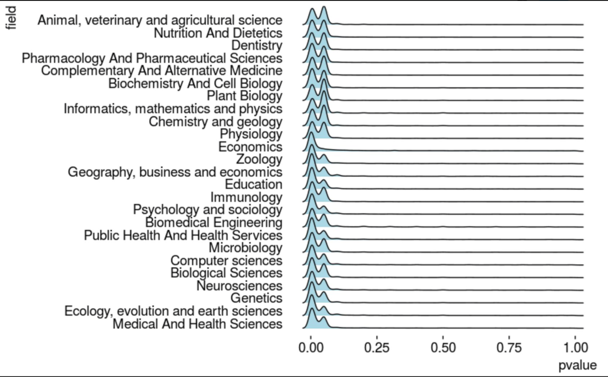
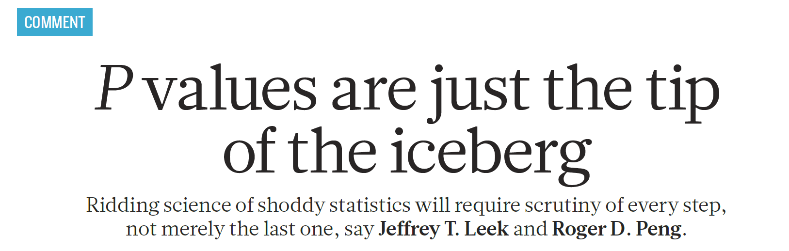

```{r setup, include=FALSE}
knitr::opts_chunk$set(comment=NA)
options(width = 55)
```

## Today's Agenda

- What I Taught for Many Years
- p-Hacking
- Do Confidence Intervals Solve the Problem?
- Borrowing from Bayesian Ideas
- Replicable Research and the Crisis in Science
- Retrospective Power and why most smart folks avoid it
    - Type S and Type M error: Saying something more useful

## What I Taught for Many Years

- Null hypothesis significance testing is here to stay.
    - Learn how to present your p value so it looks like what everyone else does
    - Think about "statistically detectable" rather than "statistically significant"
    - Don't accept a null hypothesis, just retain it.
- Use point **and** interval estimates
    - Try to get your statements about confidence intervals right (right = just like I said it)
- Use Bayesian approaches/simulation/hierarchical models when they seem appropriate or for "non-standard" designs
    - But look elsewhere for people to teach/do that stuff
- Power is basically a hurdle to overcome in a grant application

## Conventions for Reporting *p* Values

1. Use an italicized, lower-case *p* to specify the *p* value. Don't use *p* for anything else.
2. For *p* values above 0.10, round to two decimal places, at most. 
3. For *p* values near $\alpha$, include only enough decimal places to clarify the reject/retain decision. 
4. For very small *p* values, always report either *p* < 0.0001 or even just *p* < 0.001, rather than specifying the result in scientific notation, or, worse, as $p = 0$ which is glaringly inappropriate.
5. Report *p* values above 0.99 as *p* > 0.99, rather than *p* = 1.

# American Statistical Association to the rescue!?!

## ASA Statement on *p* Values

ASA Statement: "Informally, a p-value is the probability under a specified statistical model that a statistical summary of the data (e.g., the sample mean difference between two compared groups) would be equal to or more extreme than its observed value."

[$\textcolor{blue}{fivethirtyeight.com}$](http://fivethirtyeight.com/features/not-even-scientists-can-easily-explain-p-values/) "Not Even Scientists Can Easily Explain *p* Values"

... Try to distill the p-value down to an intuitive concept and it loses all its nuances and complexity, said science journalist Regina Nuzzo, a statistics professor at Gallaudet University. "Then people get it wrong, and this is why statisticians are upset and scientists are confused." **You can get it right, or you can make it intuitive, but it's all but impossible to do both.**

[$\textcolor{blue}{fivethirtyeight.com}$](http://fivethirtyeight.com/features/statisticians-found-one-thing-they-can-agree-on-its-time-to-stop-misusing-p-values/) "Statisticians found one thing they can agree on"

## A Few Comments on Significance

- **A significant effect is not necessarily the same thing as an interesting effect.**  For example, results calculated from large samples are nearly always "significant" even when the effects are quite small in magnitude.  Before doing a test, always ask if the effect is large enough to be of any practical interest.  If not, why do the test?

- **A non-significant effect is not necessarily the same thing as no difference.**  A large effect of real practical interest may still produce a non-significant result simply because the sample is too small.

- **There are assumptions behind all statistical inferences.** Checking assumptions is crucial to validating the inference made by any test or confidence interval.

- "**Scientific conclusions and business or policy decisions should not be based only on whether a p-value passes a specific threshold.**"

ASA [$\textcolor{blue}{statement}$](http://amstat.tandfonline.com/doi/pdf/10.1080/00031305.2016.1154108) on *p* values

## From George Cobb - on why *p* values deserve to be re-evaluated

The **idea** of a p-value as one possible summary of evidence

morphed into a

- **rule** for authors:  reject the null hypothesis if p < .05.

## From George Cobb - on why *p* values deserve to be re-evaluated

The **idea** of a p-value as one possible summary of evidence

morphed into a

- **rule** for authors:  reject the null hypothesis if p < .05,

which morphed into a

- **rule** for editors:  reject the submitted article if p > .05.

## From George Cobb - on why *p* values deserve to be re-evaluated

The **idea** of a p-value as one possible summary of evidence

morphed into a

- **rule** for authors:  reject the null hypothesis if p < .05,

which morphed into a

- **rule** for editors:  reject the submitted article if p > .05,

which morphed into a

- **rule** for journals:  reject all articles that report p-values\footnote{http://www.nature.com/news/psychology-journal-bans-p-values-1.17001 describes the recent banning of null hypothesis significance testing by {\it Basic and Applied Psychology}.} 

## From George Cobb - on why *p* values deserve to be re-evaluated

The **idea** of a p-value as one possible summary of evidence

morphed into a

- **rule** for authors:  reject the null hypothesis if p < .05, which morphed into a

- **rule** for editors:  reject the submitted article if p > .05, which morphed into a

- **rule** for journals:  reject all articles that report p-values. 

Bottom line:  **Reject rules.  Ideas matter.**

---


## p = 0.05?

> "For decades, the conventional p-value threshold has been 0.05," says Dr. Paul Wakim, chief of the biostatistics and clinical epidemiology service at the National Institutes of Health Clinical Center, "but it is extremely important to understand that this 0.05, there's nothing rigorous about it. It wasn't derived from statisticians who got together, calculated the best threshold, and then found that it is 0.05. No, it's Ronald Fisher, who basically said, 'Let's use 0.05,' and he admitted that it was arbitrary."

- NOVA "[\textcolor{blue}{Rethinking Science's Magic Number}](http://www.pbs.org/wgbh/nova/next/body/rethinking-sciences-magic-number/)" by Tiffany Dill 2018-02-28. See especially the video labeled "Science's most important (and controversial) number has its origins in a British experiment involving milk and tea."

## More from Dr. Wakim...

> "People say, 'Ugh, it's above 0.05, I wasted my time.' No, you didn't waste your time." says Dr. Wakim. "If the research question is important, the result is important. Whatever it is."

- NOVA Season 45 Episode 6 [\textcolor{blue}{Prediction by the Numbers}](http://www.pbs.org/video/prediction-by-the-numbers-hg2znc/) 2018-02-28.


## p values don't trend...


## George Cobb's Questions (with Answers)

In February 2014, George Cobb, Professor Emeritus of Mathematics and Statistics at Mount Holyoke College, posed these questions to an ASA discussion forum:

Q: Why do so many colleges and grad schools teach *p* = 0.05?

A: Because that's **still** what the scientific community and journal editors use.

Q: Why do so many people still use *p* = 0.05?

A: Because that's what they were taught in college or grad school.

## All the p values

> The p-value is the most widely-known statistic. P-values are reported in a large majority of scientific publications that measure and report data. R.A. Fisher is widely credited with inventing the p-value. If he was cited every time a p-value was reported his paper would have, at the very least, 3 million citations - making it the most highly cited paper of all time.

- Visit Jeff Leek's [\textcolor{blue}{Github for tidypvals package}](https://github.com/jtleek/tidypvals)
    - 2.5 million *p* values in 25 scientific fields

**What do you suppose the distribution of those p values is going to look like?**

## 2.5 million p values in 25 scientific fields: Jeff Leek



## from Michael Lopez


---


## Unfortunately...

There are a lot of candidates for the most outrageous misuse of "statistical significance" out there.

```{r, echo = FALSE, fig.align = "center", out.width = '90%'}

```

---

```{r, echo = FALSE, fig.align = "left", out.width = '110%'}

```

---

```{r, echo = FALSE, fig.align = "center", out.height = '60%'}

```

```{r, echo = FALSE, fig.align = "center", out.height = '60%'}

```

# p-Hacking

## Hack Your Way To Scientific Glory (fivethirtyeight)


## "Researcher Degrees of Freedom", 1

> [I]t is unacceptably easy to publish *statistically significant* evidence consistent with any hypothesis.

> The culprit is a construct we refer to as **researcher degrees of freedom**. In the course of collecting and analyzing data, researchers have many decisions to make: Should more data be collected? Should some observations be excluded? Which conditions should be combined and which ones compared? Which control variables should be considered? Should specific measures be combined or transformed or both?

Simmons et al. [$\textcolor{blue}{link}$](http://journals.sagepub.com/doi/abs/10.1177/0956797611417632) 

## "Researcher Degrees of Freedom", 2

> ... It is rare, and sometimes impractical, for researchers to make all these decisions beforehand. Rather, it is common (and accepted practice) for researchers to explore various analytic alternatives, to search for a combination that yields statistical significance, and to then report only what worked. The problem, of course, is that the likelihood of at least one (of many) analyses producing a falsely positive finding at the 5% level is necessarily greater than 5%.

For more, see 

- Gelman's blog [$\textcolor{blue}{2012-11-01}$](http://andrewgelman.com/2012/11/01/researcher-degrees-of-freedom/) "Researcher Degrees of Freedom", 
- Paper by [$\textcolor{blue}{Simmons}$](http://journals.sagepub.com/doi/abs/10.1177/0956797611417632) and others, defining the term.

## And this is really hard to deal with...

**The garden of forking paths**: Why multiple comparisons can be a problem, even when there is no "fishing expedition" or p-hacking and the research hypothesis was posited ahead of time

> Researcher degrees of freedom can lead to a multiple comparisons problem, even in settings
where researchers perform only a single analysis on their data. The problem is there can be a
large number of potential comparisons when the details of data analysis are highly contingent on
data, without the researcher having to perform any conscious procedure of fishing or examining
multiple p-values. We discuss in the context of several examples of published papers where
data-analysis decisions were theoretically-motivated based on previous literature, but where the
details of data selection and analysis were not pre-specified and, as a result, were contingent on
data.

- [$\textcolor{blue}{Link}$](http://www.stat.columbia.edu/~gelman/research/unpublished/p_hacking.pdf) to the paper from Gelman and Loken

## Grim Reality

- Editorial, Educational and Other Institutional Practices Will Have to Change
- It Is Going to Take Work, and It Is Going to Take Time
- Why Will Change Finally Happen Now?

## Confidence Intervals - do they solve our problem?


## Confidence Intervals - do they solve our problem?


## Confidence Intervals - do they solve our problem?


## Confidence Intervals - do they solve our problem?


## Confidence Intervals - do they solve our problem?


## Using Bayesian Ideas: Confidence Intervals

> My current favorite (hypothetical) example is an epidemiology study of some small effect where the point estimate of the odds ratio is 3.0 with a 95% conf interval of [1.1, 8.2]. 

> As a 95% conf interval, this is fine (assuming the underlying assumptions regarding sampling, causal identification, etc. are valid). 

(but on some level you need to deal with the fact that...)

> ... real-world odds ratios are much more likely to be near 1.1 than to be near 8.2. 

See [\textcolor{blue}{Gelman}](http://andrewgelman.com/2014/12/11/fallacy-placing-confidence-confidence-intervals/) 2014-12-11.

## Uncertainty intervals?

I've (Gelman) become increasingly uncomfortable with the term "confidence interval" for several reasons:

- The well-known difficulties in interpretation (officially the confidence statement can be interpreted only on average, but people typically implicitly give the Bayesian interpretation to each case.)
- The ambiguity between confidence intervals and predictive intervals.
- The awkwardness of explaining that confidence intervals are big in noisy situations where you have less confidence, and confidence intervals are small when you have more confidence.

> So here's my proposal. Let's use the term "uncertainty interval" instead. The uncertainty interval tells you how much uncertainty you have. 

See [\textcolor{blue}{Gelman}](http://andrewgelman.com/2010/12/21/lets_say_uncert/) 2010-12-21.

# Some Noisy Recent Suggestions

## Benjamin et al 2017 Redefine Statistical Significance

We propose to change the default P-value threshold for statistical significance for claims of new discoveries from 0.05 to 0.005.

Motivations:

- links to Bayes Factor interpretation
- 0.005 is stringent enough to "break" the current system - makes it very difficult for researchers to reach threshold with noisy, useless studies.

Visit the main [$\textcolor{blue}{article}$](https://psyarxiv.com/mky9j/). Visit an explanatory piece in [$\textcolor{blue}{Science}$](http://www.sciencemag.org/news/2017/07/it-will-be-much-harder-call-new-findings-significant-if-team-gets-its-way).

## Lakens et al. Justify Your Alpha

"In response to recommendations to redefine statistical significance to $p \leq .005$, we propose that researchers should transparently report and justify all choices they make when designing a study, including the alpha level." Visit [$\textcolor{blue}{link}$](https://psyarxiv.com/9s3y6).

## Abandon Statistical Significance

Gelman blog [$\textcolor{blue}{2017-09-26}$](http://andrewgelman.com/2017/09/26/abandon-statistical-significance/) on "Abandon Statistical Significance"

"Measurement error and variation are concerns even if your estimate is more than 2 standard errors from zero. Indeed, if variation or measurement error are high, then you learn almost nothing from an estimate even if it happens to be 'statistically significant.'"

Read the whole paper [$\textcolor{blue}{here}$](http://www.stat.columbia.edu/~gelman/research/unpublished/abandon.pdf)

## JAMA 2018-04-10 


## Blume et al. PLoS ONE (2018) 13(3): e0188299


## Second-generation *p* values


## *Nature* P values are just the tip of the iceberg!



## OK, so what SHOULD we do?

*The American Statistician* Volume 73, 2019, Supplement 1

Articles on:

1. Getting to a Post "*p* < 0.05" Era
2. Interpreting and Using *p*
3. Supplementing or Replacing *p*
4. Adopting more holistic approaches
5. Reforming Institutions: Changing Publication Policies and Statistical Education

- Note that there is an enormous list of "things to do" in Section 7 of the main editorial, too.

## Statistical Inference in the 21st Century


## ATOM: **A**ccept uncertainty. Be **T**houghtful, **O**pen and **M**odest.

- Statistical methods do not rid data of their uncertainty.


## ATOM: **A**ccept uncertainty. Be **T**houghtful, **O**pen and **M**odest.

> We can make acceptance of uncertainty more natural to our thinking by accompanying every point estimate in our research with a measure of its uncertainty such as a standard error or interval estimate. Reporting and interpreting point and interval estimates should be routine.

> How will accepting uncertainty change anything? To begin, it will prompt us to seek better measures, more sensitive designs, and larger samples, all of which increase the rigor of research.

> It also helps us be modest ... [and] leads us to be thoughtful.

## ATOM: **A**ccept uncertainty. Be **T**houghtful, **O**pen and **M**odest.


## ATOM: **A**ccept uncertainty. Be **T**houghtful, **O**pen and **M**odest.


## ATOM: **A**ccept uncertainty. Be **T**houghtful, **O**pen and **M**odest.


## ATOM: **A**ccept uncertainty. Be **T**houghtful, **O**pen and **M**odest.


## ATOM: **A**ccept uncertainty. Be **T**houghtful, **O**pen and **M**odest.


## ATOM: **A**ccept uncertainty. Be **T**houghtful, **O**pen and **M**odest.


## ATOM: **A**ccept uncertainty. Be **T**houghtful, **O**pen and **M**odest.


## ATOM: **A**ccept uncertainty. Be **T**houghtful, **O**pen and **M**odest.


## ATOM: **A**ccept uncertainty. Be **T**houghtful, **O**pen and **M**odest.


## ATOM: **A**ccept uncertainty. Be **T**houghtful, **O**pen and **M**odest.

> The nexus of openness and modesty is to report everything while at the same time not concluding anything from a single study with unwarranted certainty. Because of the strong desire to inform and be informed, there is a relentless demand to state results with certainty. Again, accept uncertainty and embrace variation in associations and effects, because they are always there, like it or not. Understand that expressions of uncertainty are themselves uncertain. Accept that one study is rarely definitive, so encourage, sponsor, conduct, and publish replication studies.

> Be modest by encouraging others to reproduce your work. Of course, for it to be reproduced readily, you will necessarily have been thoughtful in conducting the research and open in presenting it.

## What I Think I Think Now

- Null hypothesis significance testing is much harder than I thought.
    - The null hypothesis is almost never a real thing.
    - Rather than rejiggering the cutoff, I would largely abandon the *p* value as a summary
    - Replication is far more useful than I thought it was.
- Some hills aren't worth dying on.
    - Think about uncertainty intervals more than confidence or credible intervals
    - Retrospective calculations about Type S (sign) and Type M (magnitude) errors can help me illustrate ideas.
- Which method to use is far less important than finding better data
    - The biggest mistake I make regularly is throwing away useful data
    - I'm not the only one with this problem.
- The best thing I do most days is communicate more clearly.
    - When stuck in a design, I think about how to get better data.
    - When stuck in an analysis, I try to turn a table into a graph.
- I have A LOT to learn.