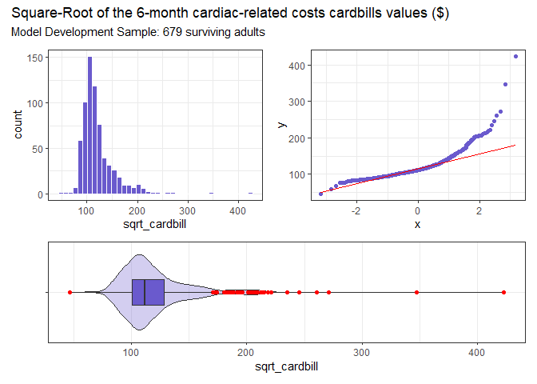
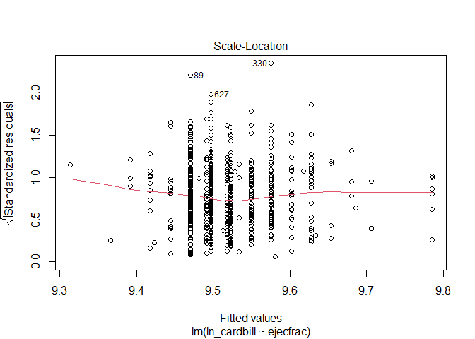

Steven Mayher: Lab 06 for PQHS 431
================
Due: 2021-11-08 \| Last Edit: 2021-11-08 20:53:13

``` r
library(MatchLinReg)
library(simputation) # for single impuation
library(car) # for boxCox
library(GGally) # for ggpairs
library(ggrepel) # help with residual plots
library(equatiomatic) # help with equation extraction
library(knitr)
library(janitor)
library(magrittr)
library(patchwork)
library(broom)
library(naniar)
library(tidyverse)

theme_set(theme_bw())
```

# The Data for Lab 06

The above code below ingests the data as necessary for the lab:

``` r
data("lindner")

lindner_alive <- lindner %>%
    filter(sixMonthSurvive == 1) %>%
    mutate(id = row_number()) %>%
    as_tibble()

set.seed(431)
lindner_alive_train = lindner_alive %>% sample_frac(0.7)
lindner_alive_test = lindner_alive %>% anti_join(lindner_alive_train, by = "id")
```

# Question 1 (20 points)

In order to determine which power transformation for the outcome would
be preferred for the `cardbill` outcome (i.e. the 6-month
cardiac-related costs) for surviving patients using the
`lindner_alive_train` data set, the code below has been used to examine
both the log transformation and the square-root transformation:

``` r
lindner_alive_train = lindner_alive_train %>%
  mutate(ln_cardbill = log(cardbill))

p1 <- ggplot(lindner_alive_train, aes(x = ln_cardbill)) +
  geom_histogram(bins = nclass.scott(na.omit(lindner_alive_train$cardbill)), fill = "slateblue", col = "white")

p2 <- ggplot(lindner_alive_train, aes(sample = ln_cardbill)) +
  geom_qq(col = "slateblue") + geom_qq_line(col = "red")

p3 <- ggplot(lindner_alive_train, aes(x = "", y = ln_cardbill)) +
  geom_violin(fill = "slateblue", alpha = 0.3) +
  geom_boxplot(fill = "slateblue", width = 0.3, outlier.color = "red") +
  labs(x = "") + coord_flip()

p1 + p2 - p3 +
  plot_layout(ncol = 1, height = c(3, 2)) +
  plot_annotation(title = "Log of the 6-month cardiac-related costs cardbills values ($)", subtitle = paste0("Model Development Sample: ", nrow(lindner_alive_train), " surviving adults, log transformation"))
```

<!-- -->

``` r
lindner_alive_train = lindner_alive_train %>%
  mutate(sqrt_cardbill = sqrt(cardbill))

p4 <- ggplot(lindner_alive_train, aes(x = sqrt_cardbill)) +
  geom_histogram(bins = nclass.scott(na.omit(lindner_alive_train$cardbill)), fill = "slateblue", col = "white")

p5 <- ggplot(lindner_alive_train, aes(sample = sqrt_cardbill)) +
  geom_qq(col = "slateblue") + geom_qq_line(col = "red")

p6 <- ggplot(lindner_alive_train, aes(x = "", y = sqrt_cardbill)) +
  geom_violin(fill = "slateblue", alpha = 0.3) +
  geom_boxplot(fill = "slateblue", width = 0.3, outlier.color = "red") +
  labs(x = "") + coord_flip()

p4 + p5 - p6 +
  plot_layout(ncol = 1, height = c(3, 2)) +
  plot_annotation(title = "Square-Root of the 6-month cardiac-related costs cardbills values ($)", subtitle = paste0("Model Development Sample: ", nrow(lindner_alive_train), " surviving adults"))
```

<!-- -->

Between the two possible transformations of the outcome as seen in the
plots above, the log transformation of the outcome fits the data better.
If we take into account the predictor `ejecfrac` with a Box-Cox plot
and/or the `powerTransform` function (both from the `car` library) as
well, the log transformation is once again shown to be the best
transformation option between the two available options, both of which
are shown below:

``` r
boxCox(lindner_alive_train$cardbill ~ lindner_alive_train$ejecfrac)
```

<!-- -->

``` r
powerTransform(lindner_alive_train$cardbill ~ lindner_alive_train$ejecfrac)
```

    Estimated transformation parameter 
            Y1 
    -0.4891587 

With this knowledge, a linear model using the log transformation was
created with the code below:

``` r
model1 = lm(ln_cardbill ~ ejecfrac, data = lindner_alive_train)
```

The exact equation for this model with the model’s coefficients is as
follows:

``` r
equatiomatic::extract_eq(model1, use_coefs = TRUE, coef_digits = 3)
```

$$
\\operatorname{\\widehat{ln\\\_cardbill}} = 9.785 - 0.005(\\operatorname{ejecfrac})
$$

``` r
tidy_model1 <- tidy(model1, conf.int = TRUE, conf.level = 0.95)

tidy_model1 %>%
  select(term, estimate, std.error, p.value, conf.low, conf.high) %>%
  knitr::kable(digits = 4)
```

| term        | estimate | std.error | p.value | conf.low | conf.high |
|:------------|---------:|----------:|--------:|---------:|----------:|
| (Intercept) |   9.7851 |    0.0861 |  0.0000 |   9.6159 |    9.9542 |
| ejecfrac    |  -0.0052 |    0.0017 |  0.0016 |  -0.0085 |   -0.0020 |

The model’s R-Squared, adjusted R-Squared, sigma, AIC, and BIC values
are as follows:

``` r
glance(model1) %>%
  mutate(name = "model1") %>%
  select(name, r.squared, adj.r.squared, sigma, AIC, BIC) %>%
  knitr::kable(digits = c(0, 3, 3, 3, 0, 0))
```

| name   | r.squared | adj.r.squared | sigma | AIC | BIC |
|:-------|----------:|--------------:|------:|----:|----:|
| model1 |     0.015 |         0.013 | 0.456 | 866 | 879 |

To interpret and contextualize the results of this regression, there are
four assumptions that should be assessed - linearity, constant variance
(i.e. homoscedasticity), normality, and independence. The first three
assumptions - linearity, constant variance, and normality - can be
assessed with residual plots. The Residuals vs Fitted plot can be used
to assess linearity, the Normal Q-Q can be used to assess normality, and
the Scale-Location plot can be used to assess constant variance, and all
three are shown below:

``` r
plot(model1, which = 1)
```

<!-- -->
From the Residuals vs Fitted plot, I’d conclude that there are not any
serious issues with non-linearity, as there isn’t any substantial bends
in the smooth line fitted to this plot.

``` r
plot(model1, which = 3)
```

<!-- -->

As with assessing a Residuals vs Fitted plot, a Scale-Location plot with
a relatively flat loess smooth line indicates constant variance. While
there is some small bend in the center of the plot, there is no
meaningful trend up or down, so I’d conclude that there’s likely no
issues with constant variance in this plot either.

``` r
plot(model1, which = 2)
```

<!-- -->

The Normal Q-Q plot above does indicate some issues with normality with
this model, however given that the ideal transformation of this data as
indicated by the Box-Cox plot above indicates that the -square-root
transformation would be ideal for this model, not the log
transformation, this isn’t entirely unexpected. The outliers could be
further examined by utilizing the `outlierTest` function to investigate
their impact on the normality, however per instruction from Piazza this
step will not be examined at this time.

To assess the final assumption, independence, we can re-examine the
first two residual plots. If the data is truly taken at random for an
experiment, then the residuals should appear to be randomly scattered
and show no trends, clumps, or other patterns when plotted against the
predictor values, and their clearly appears to be some incremental
binning pattern in both the Residuals vs Fitted and Scale-Location
plots, so their is likely an issue with dependence with this data.

# Question 2 (10 points)

To examine the effect of this third variable, `abcix`, along with the
original predictor `ejecfrac` with the transformed outcome data from the
first question, the following model was created:

``` r
model2 = lm(ln_cardbill ~ ejecfrac + abcix, data = lindner_alive_train)
```

The exact equation for this model with the model’s coefficients is as
follows:

``` r
equatiomatic::extract_eq(model2, use_coefs = TRUE, coef_digits = 3)
```

$$
\\operatorname{\\widehat{ln\\\_cardbill}} = 9.605 - 0.004(\\operatorname{ejecfrac}) + 0.18(\\operatorname{abcix})
$$

``` r
tidy_model2 <- tidy(model2, conf.int = TRUE, conf.level = 0.95)

tidy_model2 %>%
  select(term, estimate, std.error, p.value, conf.low, conf.high) %>%
  knitr::kable(digits = 4)
```

| term        | estimate | std.error | p.value | conf.low | conf.high |
|:------------|---------:|----------:|--------:|---------:|----------:|
| (Intercept) |   9.6053 |    0.0930 |  0.0000 |   9.4227 |    9.7879 |
| ejecfrac    |  -0.0042 |    0.0016 |  0.0108 |  -0.0074 |   -0.0010 |
| abcix       |   0.1802 |    0.0382 |  0.0000 |   0.1052 |    0.2553 |

The model’s R-Squared, adjusted R-Squared, sigma, AIC, and BIC values
are as follows:

``` r
glance(model2) %>%
  mutate(name = "model2") %>%
  select(name, r.squared, adj.r.squared, sigma, AIC, BIC) %>%
  knitr::kable(digits = c(0, 3, 3, 3, 0, 0))
```

| name   | r.squared | adj.r.squared | sigma | AIC | BIC |
|:-------|----------:|--------------:|------:|----:|----:|
| model2 |     0.046 |         0.043 | 0.449 | 846 | 864 |

As done with `model1` in the answer to Question 1 above, the linearity,
constant variance, normality, and independence of `model2` have been
assessed with the following plots below to interpret and contextualize
results of this new regression:

``` r
plot(model2, which = 1)
```

<!-- -->
From this Residuals vs Fitted plot, I’d conclude that there are not any
serious issues with non-linearity in this new model, as there are no
significant bends in the smooth line fitted to this plot.

``` r
plot(model2, which = 3)
```

<!-- -->

While there is some small bend in the center of this Scale-Location
plot, to a lesser degree than the plot for `model1`, there is once again
no meaningful trend up or down, so I’d conclude that there’s likely no
issues with constant variance in this plot, and thus in `model2` either.

``` r
plot(model2, which = 2)
```

<!-- -->

As with the Normal Q-Q plot for `model1`, this Normal Q-Q plot for
`model2` does indicate some issues with normality as well. Again, given
that the ideal transformation of this data as indicated by the Box-Cox
plot in Question 1 above indicates that the -square-root transformation
would be ideal for this model, not the log transformation, this isn’t
entirely unexpected that a new model with additional predictor would
stray far from this suggested transformation. The Normal Q-Q plot for
this model in particular appears to have a little more right skew than
the plot for `model1`. Again, some of the extreme outliers could be
further examined by utilizing the `outlierTest` function, however per
instruction from Piazza this step will not be examined at this time.

Lastly, given that `model2` was created by simply adding an additional
predictor variable (i.e. `abcix`) to the model used for Question 1, we
can conclude that we will likely have issues with the linearity
assumption again. Inspection of the Residuals vs Fitted plot does
confirm this though, this time with some clumping of values appearing
alongside the apparent binning pattern that was also observed in the
Residuals vs Fitted plot of `model1`. As such, their is likely still an
issue with the independence with this data.

# Question 3 (10 points)

While there isn’t really an ideal way to perform variable selection (at
least as far as we have been instructed in 431), as Dr. Love has
indicated in the lecture slides that “there is an enormous amount of
evidence that variable selection causes severe problems in estimation
and inference”, with stepwise regression being considered particularly
egregious, there really isn’t many better options at this time. As such,
a model was created below by adding the `stent`, `height`, `female`,
`diabetic`, `acutemi`, and `ves1proc` variables as predictors to the
same model used for Question 2 (i.e. `model2`) to create a new temporary
model for this Question, so a stepwise regression could be performed to
determine which predictors should and shouldn’t be kept. First, the
model was created as seen below:

``` r
model3 = lm(ln_cardbill ~ ejecfrac + abcix + stent + height + female + diabetic + acutemi + ves1proc, data = lindner_alive_train)
```

The exact equation for this model with the model’s coefficients is as
follows:

``` r
equatiomatic::extract_eq(model3, use_coefs = TRUE, coef_digits = 3)
```

$$
\\operatorname{\\widehat{ln\\\_cardbill}} = 9.497 - 0.005(\\operatorname{ejecfrac}) + 0.151(\\operatorname{abcix}) + 0.102(\\operatorname{stent}) + 0(\\operatorname{height}) + 0.048(\\operatorname{female}) - 0.007(\\operatorname{diabetic}) - 0.118(\\operatorname{acutemi}) + 0.104(\\operatorname{ves1proc})
$$

``` r
tidy_model3 <- tidy(model3, conf.int = TRUE, conf.level = 0.95)

tidy_model3 %>%
  select(term, estimate, std.error, p.value, conf.low, conf.high) %>%
  knitr::kable(digits = 4)
```

| term        | estimate | std.error | p.value | conf.low | conf.high |
|:------------|---------:|----------:|--------:|---------:|----------:|
| (Intercept) |   9.4968 |    0.3946 |  0.0000 |   8.7220 |   10.2717 |
| ejecfrac    |  -0.0049 |    0.0016 |  0.0029 |  -0.0081 |   -0.0017 |
| abcix       |   0.1512 |    0.0392 |  0.0001 |   0.0742 |    0.2282 |
| stent       |   0.1022 |    0.0362 |  0.0049 |   0.0310 |    0.1733 |
| height      |  -0.0003 |    0.0021 |  0.9039 |  -0.0045 |    0.0039 |
| female      |   0.0477 |    0.0474 |  0.3149 |  -0.0454 |    0.1408 |
| diabetic    |  -0.0071 |    0.0411 |  0.8629 |  -0.0878 |    0.0736 |
| acutemi     |  -0.1183 |    0.0496 |  0.0173 |  -0.2156 |   -0.0209 |
| ves1proc    |   0.1037 |    0.0271 |  0.0001 |   0.0505 |    0.1569 |

The model’s R-Squared, adjusted R-Squared, sigma, AIC, and BIC values
are as follows:

``` r
glance(model3) %>%
  mutate(name = "model2") %>%
  select(name, r.squared, adj.r.squared, sigma, AIC, BIC) %>%
  knitr::kable(digits = c(0, 3, 3, 3, 0, 0))
```

| name   | r.squared | adj.r.squared | sigma | AIC | BIC |
|:-------|----------:|--------------:|------:|----:|----:|
| model2 |     0.088 |         0.077 | 0.441 | 827 | 873 |

The stepwise analysis is as follows:

``` r
step(model3)
```

    Start:  AIC=-1101.57
    ln_cardbill ~ ejecfrac + abcix + stent + height + female + diabetic + 
        acutemi + ves1proc

               Df Sum of Sq    RSS     AIC
    - height    1   0.00284 130.55 -1103.6
    - diabetic  1   0.00582 130.56 -1103.5
    - female    1   0.19711 130.75 -1102.5
    <none>                  130.55 -1101.6
    - acutemi   1   1.10892 131.66 -1097.8
    - stent     1   1.55016 132.10 -1095.6
    - ejecfrac  1   1.73924 132.29 -1094.6
    - ves1proc  1   2.85742 133.41 -1088.9
    - abcix     1   2.89667 133.45 -1088.7

    Step:  AIC=-1103.56
    ln_cardbill ~ ejecfrac + abcix + stent + female + diabetic + 
        acutemi + ves1proc

               Df Sum of Sq    RSS     AIC
    - diabetic  1   0.00584 130.56 -1105.5
    <none>                  130.55 -1103.6
    - female    1   0.39145 130.94 -1103.5
    - acutemi   1   1.11573 131.67 -1099.8
    - stent     1   1.54929 132.10 -1097.5
    - ejecfrac  1   1.73680 132.29 -1096.6
    - ves1proc  1   2.85768 133.41 -1090.9
    - abcix     1   2.92114 133.47 -1090.5

    Step:  AIC=-1105.53
    ln_cardbill ~ ejecfrac + abcix + stent + female + acutemi + ves1proc

               Df Sum of Sq    RSS     AIC
    <none>                  130.56 -1105.5
    - female    1   0.38644 130.95 -1105.5
    - acutemi   1   1.11273 131.67 -1101.8
    - stent     1   1.55290 132.11 -1099.5
    - ejecfrac  1   1.73112 132.29 -1098.6
    - ves1proc  1   2.85186 133.41 -1092.9
    - abcix     1   2.96188 133.52 -1092.3


    Call:
    lm(formula = ln_cardbill ~ ejecfrac + abcix + stent + female + 
        acutemi + ves1proc, data = lindner_alive_train)

    Coefficients:
    (Intercept)     ejecfrac        abcix        stent       female      acutemi  
       9.448212    -0.004885     0.152072     0.102238     0.050901    -0.118345  
       ves1proc  
       0.103507  

For clarification, stepwise regression examines how the AIC value for a
model changes when removing a predictor, removes the predictor that
causes the AIC value to decrease the most, and then repeats until the
AIC value doesn’t decrease anymore from removing predictors. With this
in mind, the stepwise regression suggests that the `height` and
`diabetic` variables be removed from the model.

One of the few other options that can be used to further examine these
results and check for correlation issues specifically is to examine the
**variance inflation factor**, as seen below:

``` r
vif(model3)
```

    ejecfrac    abcix    stent   height   female diabetic  acutemi ves1proc 
    1.049906 1.110448 1.024075 1.728934 1.743425 1.017988 1.048900 1.043518 

None of the values above exceed 5, so there doesn’t appear to be any
problem with collinearity here.

As done with `model1` and `model2` in the answers to Questions 1 and 2
above, the linearity, constant variance, normality, and independence of
`model3` have been assessed with the following plots below to interpret
and contextualize results of this new regression:

``` r
plot(model3, which = 1)
```

<!-- -->

As with the first two models, the Residuals vs Fitted plot for `model3`
doesn’t appear to indicate any issues with linearity in this new model.

``` r
plot(model3, which = 3)
```

<!-- -->

Again, as with the Scale-Location plots for the first two models, there
doesn’t appear to be any significant bend in the smooth in the
Scale-Location plot for `model3`, indicating that there is likely no
issue with constant variance for this model.

``` r
plot(model3, which = 2)
```

<!-- -->

As with the previous two models, `model3` again appears to display some
issues with normality, however this could once again likely be mitigated
by choosing a better power transformation for the model than the
permitted choices allowed.

Lastly, unlike the first two models, the Residuals vs Fitted and
Scale-Location plots both appear to show much less trends, patterns, and
/ or clumps than the first two models, however I’m still not certain as
to whether or not I’d say it passes the independence assumption in its
current state.

# Question 4 (10 points)

The necessary code for creating a new model based off of `model3` that
uses an interaction term between `height` and `female` has been provided
below:

``` r
model4 = lm(ln_cardbill ~ ejecfrac + stent + height * female + diabetic + acutemi + ves1proc, data = lindner_alive_train)
```

The exact equation for this model with the model’s coefficients is as
follows:

``` r
equatiomatic::extract_eq(model4, use_coefs = TRUE, coef_digits = 3)
```

$$
\\operatorname{\\widehat{ln\\\_cardbill}} = 9.397 - 0.006(\\operatorname{ejecfrac}) + 0.12(\\operatorname{stent}) + 0.001(\\operatorname{height}) + 0.91(\\operatorname{female}) - 0.019(\\operatorname{diabetic}) - 0.085(\\operatorname{acutemi}) + 0.124(\\operatorname{ves1proc}) - 0.005(\\operatorname{height} \\times \\operatorname{female})
$$

``` r
tidy_model4 <- tidy(model2, conf.int = TRUE, conf.level = 0.95)

tidy_model4 %>%
  select(term, estimate, std.error, p.value, conf.low, conf.high) %>%
  knitr::kable(digits = 4)
```

| term        | estimate | std.error | p.value | conf.low | conf.high |
|:------------|---------:|----------:|--------:|---------:|----------:|
| (Intercept) |   9.6053 |    0.0930 |  0.0000 |   9.4227 |    9.7879 |
| ejecfrac    |  -0.0042 |    0.0016 |  0.0108 |  -0.0074 |   -0.0010 |
| abcix       |   0.1802 |    0.0382 |  0.0000 |   0.1052 |    0.2553 |

The model’s R-Squared, adjusted R-Squared, sigma, AIC, and BIC values
are as follows:

``` r
glance(model4) %>%
  mutate(name = "model4") %>%
  select(name, r.squared, adj.r.squared, sigma, AIC, BIC) %>%
  knitr::kable(digits = c(0, 3, 3, 3, 0, 0))
```

| name   | r.squared | adj.r.squared | sigma | AIC | BIC |
|:-------|----------:|--------------:|------:|----:|----:|
| model4 |     0.069 |         0.058 | 0.446 | 841 | 886 |

As done with `model1`, `model2`, and `model3` in the answers to
Questions 1, 2, and 3 above, the linearity, constant variance,
normality, and independence of `model4` have been assessed with the
following plots below to interpret and contextualize results of this new
regression:

``` r
plot(model4, which = 1)
```

<!-- -->

As with the first three models, the Residuals vs Fitted plot for
`model4` doesn’t appear to indicate any issues with linearity in this
new model.

``` r
plot(model4, which = 3)
```

<!-- -->

Again, as with the Scale-Location plots for the first two models, there
doesn’t appear to be any substantial bend in the smooth in the
Scale-Location plot for `model4`, indicating that there is likely no
issue with constant variance for this model.

``` r
plot(model4, which = 2)
```

<!-- -->

As with the previous three models, `model4` again appears to display
some issues with normality, however this could once again likely be
mitigated by choosing a better power transformation for the model than
the permitted choices allowed.

Lastly, unlike the first two models, the Residuals vs Fitted and
Scale-Location plots both appear to show much less trends, patterns, and
/ or clumps than the first two models, just as seen with `model3`.
However I’m still not certain as to whether or not I’d say it passes the
independence assumption in its current state.

# Question 5 (20 points)

The necessary code for creating the new tibbles needed to analyze the
MAPE, RMSPE, and maximum prediction error from the test data is provided
below:

``` r
lindner_alive_test = lindner_alive_test %>%
  mutate(ln_cardbill = log(cardbill))


model1_test = augment(model1, newdata = lindner_alive_test) %>%
  mutate(name = "model1", fit_cardbill = exp(.fitted), res_cardbill = cardbill - fit_cardbill)

model2_test =  augment(model2, newdata = lindner_alive_test) %>%
  mutate(name = "model2", fit_cardbill = exp(.fitted), res_cardbill = cardbill - fit_cardbill)

model3_test =  augment(model3, newdata = lindner_alive_test) %>%
  mutate(name = "model3", fit_cardbill = exp(.fitted), res_cardbill = cardbill - fit_cardbill)

model4_test =  augment(model4, newdata = lindner_alive_test) %>%
  mutate(name = "model4", fit_cardbill = exp(.fitted), res_cardbill = cardbill - fit_cardbill)
```

The code to produce the tables comparing the results across the models
is provided below:

``` r
bind_rows(glance(model1), glance(model2), glance(model3), glance(model4)) %>%
  mutate(Names = c("model1", "model2", "model3", "model4")) %>%
  select(Names, r2 = r.squared, adj_r2 = adj.r.squared, sigma, AIC, BIC, df, df_res = df.residual) %>%
  kable(digits = c(0, 4, 4, 5, 1, 0, 0, 0))
```

| Names  |     r2 | adj_r2 |   sigma |   AIC | BIC |  df | df_res |
|:-------|-------:|-------:|--------:|------:|----:|----:|-------:|
| model1 | 0.0145 | 0.0131 | 0.45638 | 865.6 | 879 |   1 |    677 |
| model2 | 0.0459 | 0.0431 | 0.44938 | 845.7 | 864 |   2 |    676 |
| model3 | 0.0876 | 0.0767 | 0.44142 | 827.3 | 873 |   8 |    670 |
| model4 | 0.0691 | 0.0580 | 0.44587 | 841.0 | 886 |   8 |    670 |

``` r
test_comp = bind_rows(model1_test, model2_test, model3_test, model4_test) %>%
  arrange(id, name)

test_comp %>%
  group_by(name) %>%
  summarize(n = n(),
            MAPE = mean(abs(res_cardbill)),
            RMSPE = sqrt(mean(res_cardbill^2)),
            max_error = max(abs(res_cardbill))) %>%
  kable(digits = c(0, 0, 4, 3, 2))
```

| name   |   n |     MAPE |    RMSPE | max_error |
|:-------|----:|---------:|---------:|----------:|
| model1 | 291 | 5794.436 | 9934.054 |  54864.59 |
| model2 | 291 | 5763.816 | 9862.999 |  56729.18 |
| model3 | 291 | 5747.325 | 9760.114 |  55854.08 |
| model4 | 291 | 5832.726 | 9856.255 |  54628.33 |

In the training sample, `model3` has the best R-square, adjusted
R-square, sigma, and AIC values, however `model2` has the best BIC
value.

In the data from the withheld test sample though, `model3` has the best
(i.e. smallest) mean APE (MAPE) and RMSPE values, however `model4` has
the smallest maximum predictive error.

As such, in both the training and test samples, `model3` performed the
best overall.

-   *It’s worth noting that I do find the incredibly large values for
    the MAPE, RMSPE, and max_error concerning, however I genuinely
    cannot find anything incorrect about my analysis, so if I have made
    an error here please let me know.*

# Question 6 (20 points)

What we’ve done in this assignment is work through a simple linear
regression, visualizing and interpreting the role of a potential
cofounder, adjusting for this cofounder, expanding the model, and
comparing the resultant models created at each step of the process to
draw conclusions about them. There are a number of ways that we could
relate what was done in this assignment back to Spiegelhalter text,
however the one that stands out the most to me is the importance of
transparency and rigorous statistical analysis when examining
experimental data, as discussed in chapter 10 of Spiegelhalter. It is
important to examine multiple different possible predictors and
cofounders, perform proper transformations of the data, and maintain
transparency with the data, analyses, and results, among many other
factors when creating models of any kind (not just linear models) and
reporting their results. For example, failing to consider multiple
impacting variables on a model can lead to incorrect conclusions about
the associated data, which even if done unintentionally can lead to
statistical fraud, which is discussed at length in chapter 10 of
Spiegelhalter.

## Session Information

``` r
sessionInfo()
```

    R version 4.1.1 (2021-08-10)
    Platform: x86_64-w64-mingw32/x64 (64-bit)
    Running under: Windows 10 x64 (build 19043)

    Matrix products: default

    locale:
    [1] LC_COLLATE=English_United States.1252 
    [2] LC_CTYPE=English_United States.1252   
    [3] LC_MONETARY=English_United States.1252
    [4] LC_NUMERIC=C                          
    [5] LC_TIME=English_United States.1252    

    attached base packages:
    [1] stats     graphics  grDevices utils     datasets  methods   base     

    other attached packages:
     [1] forcats_0.5.1      stringr_1.4.0      dplyr_1.0.7        purrr_0.3.4       
     [5] readr_2.0.2        tidyr_1.1.4        tibble_3.1.6       tidyverse_1.3.1   
     [9] naniar_0.6.1       broom_0.7.10       patchwork_1.1.1    magrittr_2.0.1    
    [13] janitor_2.1.0      knitr_1.36         equatiomatic_0.3.0 ggrepel_0.9.1     
    [17] GGally_2.1.2       ggplot2_3.3.5      car_3.0-12         carData_3.0-4     
    [21] simputation_0.2.7  MatchLinReg_0.7.3 

    loaded via a namespace (and not attached):
     [1] fs_1.5.0            lubridate_1.8.0     RColorBrewer_1.1-2 
     [4] httr_1.4.2          tools_4.1.1         backports_1.3.0    
     [7] utf8_1.2.2          R6_2.5.1            rpart_4.1-15       
    [10] Hmisc_4.6-0         DBI_1.1.1           colorspace_2.0-2   
    [13] nnet_7.3-16         withr_2.4.2         tidyselect_1.1.1   
    [16] gridExtra_2.3       compiler_4.1.1      cli_3.1.0          
    [19] rvest_1.0.2         htmlTable_2.3.0     xml2_1.3.2         
    [22] labeling_0.4.2      scales_1.1.1        checkmate_2.0.0    
    [25] digest_0.6.28       foreign_0.8-81      rmarkdown_2.11     
    [28] base64enc_0.1-3     jpeg_0.1-9          pkgconfig_2.0.3    
    [31] htmltools_0.5.2     highr_0.9           dbplyr_2.1.1       
    [34] fastmap_1.1.0       htmlwidgets_1.5.4   rlang_0.4.12       
    [37] readxl_1.3.1        rstudioapi_0.13     shiny_1.7.1        
    [40] farver_2.1.0        generics_0.1.1      jsonlite_1.7.2     
    [43] Formula_1.2-4       Matrix_1.3-4        Rcpp_1.0.7         
    [46] munsell_0.5.0       fansi_0.5.0         abind_1.4-5        
    [49] lifecycle_1.0.1     visdat_0.5.3        stringi_1.7.5      
    [52] yaml_2.2.1          snakecase_0.11.0    MASS_7.3-54        
    [55] plyr_1.8.6          grid_4.1.1          promises_1.2.0.1   
    [58] crayon_1.4.2        lattice_0.20-45     haven_2.4.3        
    [61] splines_4.1.1       Matching_4.9-11     hms_1.1.1          
    [64] pillar_1.6.4        reprex_2.0.1        glue_1.5.0         
    [67] evaluate_0.14       latticeExtra_0.6-29 data.table_1.14.2  
    [70] modelr_0.1.8        png_0.1-7           vctrs_0.3.8        
    [73] tzdb_0.2.0          httpuv_1.6.3        cellranger_1.1.0   
    [76] gtable_0.3.0        reshape_0.8.8       assertthat_0.2.1   
    [79] xfun_0.28           gower_0.2.2         mime_0.12          
    [82] xtable_1.8-4        later_1.3.0         survival_3.2-13    
    [85] cluster_2.1.2       ellipsis_0.3.2     
