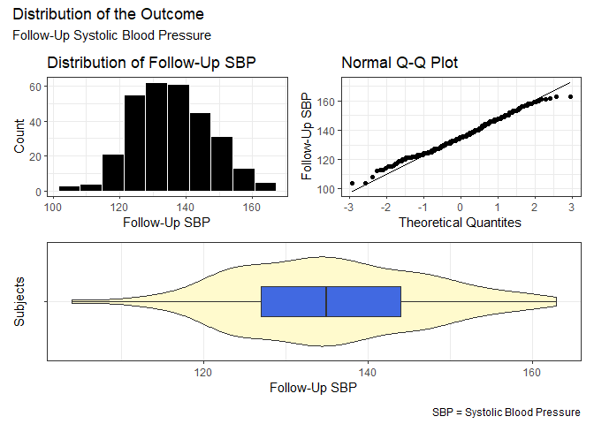
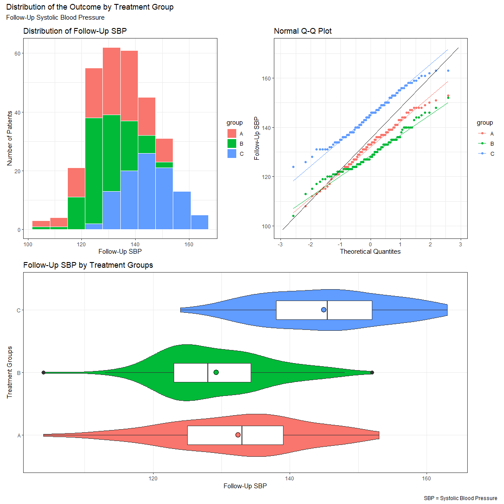
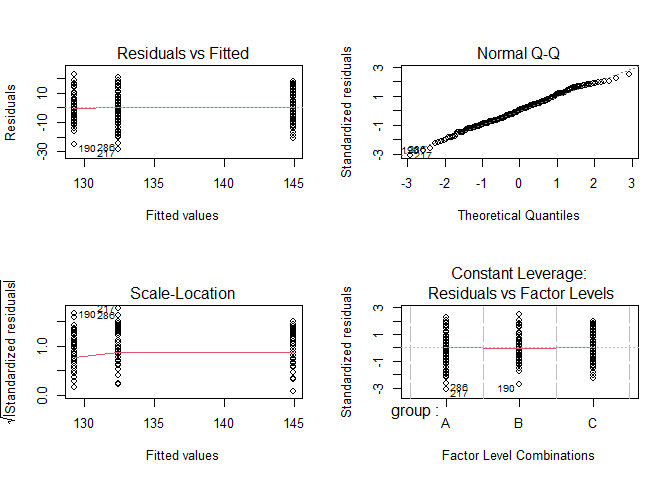
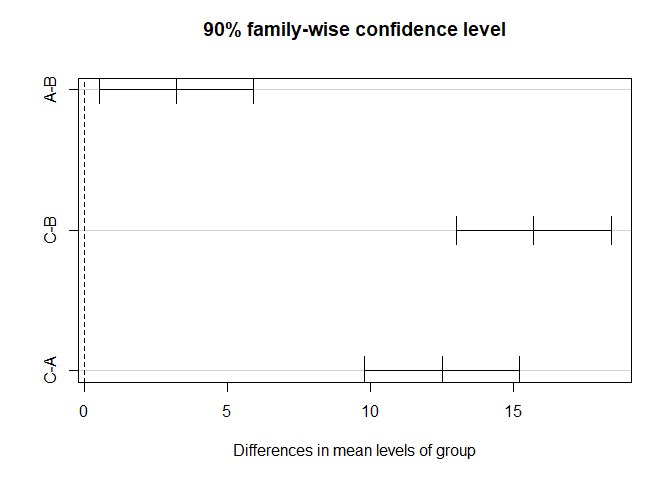

431 Lab 07
================
Due: 2021-11-15 \| Last Edit: 2021-11-15 23:20:44

``` r
library(readxl)

library(janitor)
```


    Attaching package: 'janitor'

    The following objects are masked from 'package:stats':

        chisq.test, fisher.test

``` r
library(knitr)
library(magrittr)
library(naniar)
library(simputation) # to permit imputation work
```


    Attaching package: 'simputation'

    The following object is masked from 'package:naniar':

        impute_median

``` r
library(broom)
library(car)
```

    Loading required package: carData

``` r
library(equatiomatic)
library(patchwork)
library(GGally) # to build scatterplot matrices
```

    Loading required package: ggplot2

    Registered S3 method overwritten by 'GGally':
      method from   
      +.gg   ggplot2

``` r
library(tidyselect)
library(tidyverse) # always load tidyverse last
```

    -- Attaching packages --------------------------------------- tidyverse 1.3.1 --

    v tibble  3.1.6     v dplyr   1.0.7
    v tidyr   1.1.4     v stringr 1.4.0
    v readr   2.0.2     v forcats 0.5.1
    v purrr   0.3.4     

    -- Conflicts ------------------------------------------ tidyverse_conflicts() --
    x tidyr::extract()   masks magrittr::extract()
    x dplyr::filter()    masks stats::filter()
    x dplyr::lag()       masks stats::lag()
    x dplyr::recode()    masks car::recode()
    x purrr::set_names() masks magrittr::set_names()
    x purrr::some()      masks car::some()

``` r
theme_set(theme_bw())
```

Lab 07 is divided into 8 questions. Be sure to respond to each of them
by the deadline posted on the [Course
Calendar](https://thomaselove.github.io/431/calendar.html).

## Learning Objectives

1.  Appropriately prepare data, check assumptions, execute appropriate
    modeling strategies, and interpret results

**PLEASE NOTE**: Your response to **every** question, whether we
explicitly ask for it or not, should include a complete English sentence
responding to the question. Code alone is not a sufficient response,
even if the code is correct. Some responses might not need any code, but
every response needs at least one complete sentence.

## The Data for Lab 07

Lab 07 uses some data which we have simulated to reflect a clinical
trial. In this trial, the investigators are testing out a new drug to
see its effect on a subject’s systolic blood pressure (SBP). For our
purposes, if a subject’s SBP is over 130 mm Hg they are considered to
have hypertension. In this trial, the goal was to reduce the SBP from a
baseline level by using a new drug (Treatment C), and comparing that to
the current top-of-the-line drug (Treatment B), and the oldest drug
(Treatment A). The trial focused specifically on non-Hispanic
African-American women who were in long-term relationships and between
the ages of 55 and 65 years old, with a minimal comorbidity profile. The
outcome of interest is the post-treatment systolic blood pressure
(`sbp_follow`), and we are also given the subject’s age, their
pre-treatment systolic blood pressure (`sbp_baseline`) and whether or
not the subject’s partner has hypertension.

| Variable       | Description                                                  |
|:---------------|:-------------------------------------------------------------|
| `subjectid`    | unique subject identifier                                    |
| `group`        | treatment group where, 1 = Group A, 2 = Group B, 3 = Group C |
| `partner`      | whether or not the subject’s partner also has hypertension   |
| `age`          | subject age in years at baseline                             |
| `sbp_baseline` | subject’s baseline systolic blood pressure (mm Hg)           |
| `sbp_follow`   | subject’s follow-up systolic blood pressure (mm Hg)          |

The data has been made available to you in an Excel file called
`lab07_trial.xls` available on [our 431-data
page](https://github.com/THOMASELOVE/431-data).

## Question 1 (10 points)

Ingest the data, and then make sure that (a) group is a meaningfully
leveled factor, (b) partnership status is a factor, and (c) age and the
two blood pressure results are properly numeric variables, and to look
for missing data. Once you’ve done this, run some simple and attractive,
well-annotated summaries to report the number of subjects per group, as
well as the partnership status, age and baseline blood pressure levels
of the subjects in each group. Do the groups look comparable on these
three baseline variables?

The code below imports the data from the `lab07_trials` data file:

``` r
lab07_trials = read_xls("C:/Users/smmay/OneDrive/Education/College/Coursework/CWRU/PQHS 431 - Statistical Methods I/431-2021/labs/lab07/data/lab07_trial.xls")
```

    New names:
    * `` -> ...1

``` r
glimpse(lab07_trials)
```

    Rows: 300
    Columns: 7
    $ ...1         <dbl> 1, 2, 3, 4, 5, 6, 7, 8, 9, 10, 11, 12, 13, 14, 15, 16, 17~
    $ patientid    <chr> "P001", "P002", "P003", "P004", "P005", "P006", "P007", "~
    $ group        <dbl> 3, 3, 1, 1, 3, 1, 2, 2, 1, 3, 3, 1, 2, 2, 3, 2, 2, 3, 3, ~
    $ partner      <chr> "partner with htn", "partner no htn", "partner with htn",~
    $ age          <dbl> 61, 60, 57, 64, 57, 57, 63, 60, 63, 64, 61, 56, 62, 65, 6~
    $ sbp_baseline <dbl> 142, 148, 150, 154, 139, 163, 152, 135, 170, 131, 149, 14~
    $ sbp_follow   <dbl> 134, 157, 125, 132, 136, 133, 125, 123, 138, 124, 137, 13~

Using the glimpse of the data above, steps (a), (b), and (c) of this
question have been assessed with the code below:

``` r
lab07_trials = lab07_trials %>%
  clean_names() %>%
  mutate(group = case_when(
    group == 1 ~ "A",
    group == 2 ~ "B",
    group == 3 ~ "C")) %>%
  mutate(group = as.factor(group)) %>%
  mutate(partner = case_when(
    partner == "partner with htn" ~ "Yes",
    partner == "partner no htn" ~ "No")) %>%
  rename(partner_hypertension = partner) %>%
  mutate(partner_hypertension = as.factor(partner_hypertension)) %>%
  mutate(age = as.numeric(age)) %>%
  mutate(sbp_baseline = as.numeric(sbp_baseline)) %>%
  mutate(sbp_follow = as.numeric(sbp_follow))

glimpse(lab07_trials)
```

    Rows: 300
    Columns: 7
    $ x1                   <dbl> 1, 2, 3, 4, 5, 6, 7, 8, 9, 10, 11, 12, 13, 14, 15~
    $ patientid            <chr> "P001", "P002", "P003", "P004", "P005", "P006", "~
    $ group                <fct> C, C, A, A, C, A, B, B, A, C, C, A, B, B, C, B, B~
    $ partner_hypertension <fct> Yes, No, Yes, No, Yes, Yes, No, No, Yes, No, Yes,~
    $ age                  <dbl> 61, 60, 57, 64, 57, 57, 63, 60, 63, 64, 61, 56, 6~
    $ sbp_baseline         <dbl> 142, 148, 150, 154, 139, 163, 152, 135, 170, 131,~
    $ sbp_follow           <dbl> 134, 157, 125, 132, 136, 133, 125, 123, 138, 124,~

``` r
miss_var_summary(lab07_trials)
```

    # A tibble: 7 x 3
      variable             n_miss pct_miss
      <chr>                 <int>    <dbl>
    1 x1                        0        0
    2 patientid                 0        0
    3 group                     0        0
    4 partner_hypertension      0        0
    5 age                       0        0
    6 sbp_baseline              0        0
    7 sbp_follow                0        0

``` r
lab07_trials %>% count(group)
```

    # A tibble: 3 x 2
      group     n
      <fct> <int>
    1 A       100
    2 B       100
    3 C       100

## Question 2 (10 points)

Next, we’d like to know if our outcome, `sbp_follow`, seems
appropriately modeled with a Normal distribution. Create a figure
containing at least two nicely annotated panels (presented together
using tools from the patchwork package) to assess whether a Normal model
might be appropriate for this outcome. One of your panels should include
a well-labeled Normal Q-Q plot. Then write a sentence of two to describe
what you’ve done and your conclusions.

``` r
p1 = ggplot(data = lab07_trials, aes(x = sbp_follow)) +
  geom_histogram(colour = "white", fill = "black", bins = nclass.scott(na.omit(lab07_trials$sbp_follow))) +
  labs(x = "Follow-Up SBP", y = "Count", title = "Distribution of Follow-Up SBP")

p2 = ggplot(data = lab07_trials, aes(sample = sbp_follow)) +
  geom_point(stat = "qq") +
  geom_qq_line() +
  labs(x = "Theoretical Quantites", y = "Follow-Up SBP", title = "Normal Q-Q Plot")

p3 = ggplot(lab07_trials, aes(x = "", y = sbp_follow)) +
  geom_violin(fill = "lemonchiffon") +
  geom_boxplot(width = 0.3, fill = "royalblue", outlier.size = 3, outlier.color = "royalblue") +
  coord_flip() +
  labs(x = "Subjects", y = "Follow-Up SBP")

p1 + p2 - p3 +
  plot_layout(nrow = 2) +
  plot_annotation(title = "Distribution of the Outcome", subtitle = "Follow-Up Systolic Blood Pressure", caption = "SBP = Systolic Blood Pressure")
```

<!-- -->

Above I have created a histogram, Normal Q-Q plot, and a box plot with
an overlaying violin plot to examine the distribution of the outcome
`sbp_follow`. As all three of the plots demonstrate, this outcome does
appear to follow a normal distribution.

## Question 3 (15 points)

Produce a figure to compare the three groups that allows you to assess
the Normality and Equal Variances assumptions of an ANOVA to compare the
SBP at follow-up means across the three treatment groups, ignoring all
other information available in the data. What conclusions can you draw
about ANOVA assumptions in this setting?

``` r
p4 = ggplot(lab07_trials, aes(x = sbp_follow)) +
  geom_histogram(aes(fill = group), colour = "white", bins = nclass.scott(na.omit(lab07_trials$sbp_follow))) +
  labs(x = "Follow-Up SBP", y = "Number of Patients", title = "Distribution of Follow-Up SBP")

p5 = ggplot(data = lab07_trials, aes(sample = sbp_follow)) +
  geom_point(stat = "qq", aes(fill = group, colour = group)) +
  geom_qq_line() +
  geom_qq_line(aes(colour = group)) +
  labs(x = "Theoretical Quantites", y = "Follow-Up SBP", title = "Normal Q-Q Plot")

p6 = ggplot(lab07_trials, aes(x = group, y = sbp_follow)) +
  geom_violin(aes(fill = group)) +
  geom_boxplot(width = 0.3, outlier.size = 3) +
  stat_summary(aes(fill = group), fun = mean, geom = "point", pch = 21, size = 4) +
  guides(fill = "none") +
  coord_flip() +
  labs(y = "Follow-Up SBP", x = "Treatment Groups", title = "Follow-Up SBP by Treatment Groups")

p4 + p5 - p6 +
  plot_layout(nrow = 2, ncol = 1) +
  plot_annotation(title = "Distribution of the Outcome by Treatment Group", subtitle = "Follow-Up Systolic Blood Pressure", caption = "SBP = Systolic Blood Pressure")
```

<!-- -->

The first figure above shows the distribution of the outcome
`sbp_follow` by treatment groups via the overlaying histogram plots, and
the normality of each treatment group in the Normal Q-Q plot. The
overlaying histograms indicate some skew in treatment group B, however
groups A and C appear relatively normally distributed and varied. The
Normal Q-Q plots for each group (the black line represents the normal
fit line of all three groups combined), indicates a normal distribution
for group A, higher uniformity than expected for group C, and right skew
for group B. The second figure, shown below, shows the Residuals vs
Fitted, Normal Q-Q, Scale-Location, and Constant Leverage for a linear
model created using this data:

``` r
par(mfrow = c(2,2)); plot(lm(sbp_follow ~ group, data = lab07_trials)); par(mfrow = c(1,1))
```

<!-- -->

``` r
lab07_trials %$%
  pairwise.t.test(sbp_follow, group, p.adjust.method = "holm")
```


        Pairwise comparisons using t tests with pooled SD 

    data:  sbp_follow and group 

      A      B     
    B 0.015  -     
    C <2e-16 <2e-16

    P value adjustment method: holm 

``` r
tukey1 <- lab07_trials %$%
  TukeyHSD(aov(sbp_follow ~ group), ordered = TRUE, conf.level = 0.90)

tidy(tukey1) %>% kable(digits = 3)
```

| term  | contrast | null.value | estimate | conf.low | conf.high | adj.p.value |
|:------|:---------|-----------:|---------:|---------:|----------:|------------:|
| group | A-B      |          0 |     3.21 |    0.509 |     5.911 |       0.039 |
| group | C-B      |          0 |    15.71 |   13.009 |    18.411 |       0.000 |
| group | C-A      |          0 |    12.50 |    9.799 |    15.201 |       0.000 |

``` r
plot(tukey1)
```

<!-- -->

## Question 4 (10 points)

Now complete the comparison of the SBP at follow-up means of the three
treatment groups (A, B and C) using an analysis of variance. What
conclusions do you draw, using a **90%** confidence level? Call this
`model4`.

To assess constant variance, the following figures were created:

``` r
model4 = lm(sbp_follow ~ group, data = lab07_trials)

anova(model4) %>% kable(digits = 3)
```

|           |  Df |   Sum Sq |  Mean Sq | F value | Pr(>F) |
|:----------|----:|---------:|---------:|--------:|-------:|
| group     |   2 | 13778.61 | 6889.303 |  80.184 |      0 |
| Residuals | 297 | 25517.74 |   85.918 |      NA |     NA |

``` r
tidy(model4, conf.int = TRUE, conf.level = 0.90) %>%
  select(term, estimate, std.error, conf.low, conf.high) %>%
  kable(digits = 3)
```

| term        | estimate | std.error | conf.low | conf.high |
|:------------|---------:|----------:|---------:|----------:|
| (Intercept) |   132.45 |     0.927 |  130.921 |   133.979 |
| groupB      |    -3.21 |     1.311 |   -5.373 |    -1.047 |
| groupC      |    12.50 |     1.311 |   10.337 |    14.663 |

``` r
par(mfrow = c(2,2)); plot(model4); par(mfrow = c(1,1))
```

<!-- -->

The second plot shows the Residuals vs Fitted, Normal Q-Q,
Scale-Location, and Constant Leverage of a linear model of the outcome
based off the treatment groups. Since the treatment groups `group`
variable is a factor variable, the Scale-Location plot isn’t incredibly
helpful for determining the constant variance,

## Question 5 (10 points)

Augment your results in Question 4 by incorporating baseline SBP levels
into the comparison. Call this `model5`. How do your conclusions change
about the effects of the various treatment groups in this revised model?
Again, use a 90% confidence level.

## Question 6 (10 points)

Now, create `model6` by augmenting the model you fit in Question 5 to
see if `partner` may also play a meaningful predictive role in a model
for our outcome. Interpret whether the model’s quality of fit has
improved, and and discuss what the addition of `partner` did to your
estimates about the impact of the treatment groups on the outcome.

## Question 7 (15 points)

Now, to create your final model (`model7`), instead of adjusting for
`partner`, take into account the subject’s `age` as well as the baseline
systolic blood pressure.

Then build a comparison of the four models you’ve fit (in models
`model4` through `model7`) in terms of the quality of fit (as measured
by R-square, adjusted R-square, sigma, AIC and BIC) in the available
data. What conclusions can you draw about fit quality for in comparing
these four models? Does one model stand out as better or worse than the
others? Why or why not?

## Question 8 (20 points)

Throughout the above questions, we’ve been presented with a number of
*p* values. In Chapter 10 of Spiegelhalter’s *The Art of Statistics*,
there is a robust discussion of *p* values. Write a short essay (150
words would be sufficient), which applies what you’ve learned from
Spiegelhalter’s Chapter 10 to the analyses you completed in Questions
1-7.

## Session Information

Be sure to include the session information using one of the methods we
have demonstrated.

## Submitting your Response

Submit both your working R Markdown file and the HTML output file to
[Canvas in the Lab 07 section of the Assignments
folder](https://canvas.case.edu) by the deadline specified in [the
Course Calendar](https://thomaselove.github.io/431/calendar.html).
